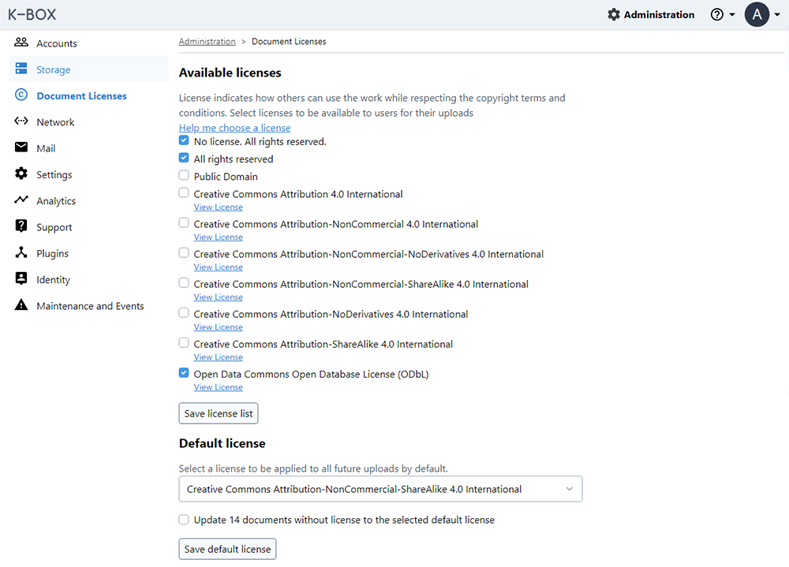

# License and Copyright

We value everyone's work, so we introduced a more fine-grained control over the Copyright Owner information and the ability to specify what other users can do with your work license.
Without the explicit indication of the licenses, there is a danger of infringing the ownership rights for the content on K-Link Network and the K-Boxes. In order to protect K-Link users and participating organizations against lawsuits, it is important to state the copyrights and license to inform users about the potential allowed uses for the contents. More about [licenses](../user/licenses.md) in K-Box

### Licenses configuration

The  administrator of K-Box can configure the list of available licenses for their K-Box users and set default license for all documents.

