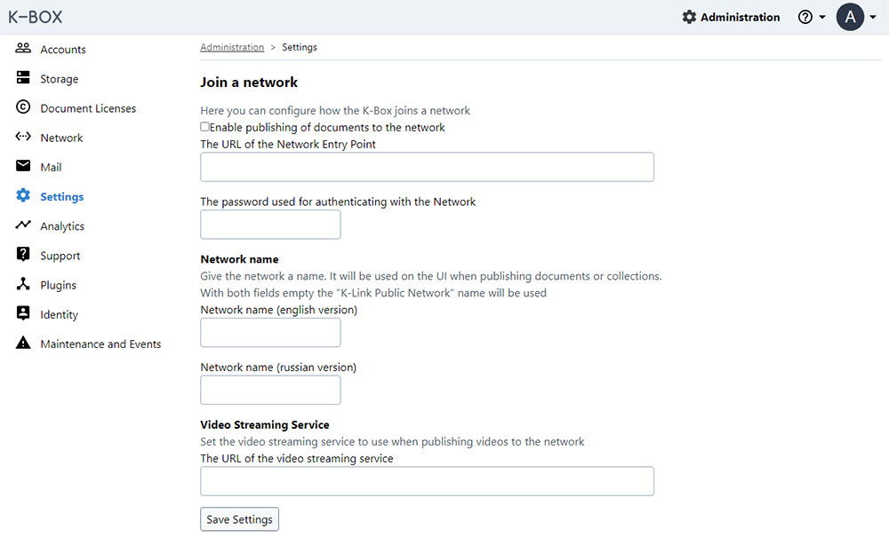

# Join a network

The K-Link K-Box has the ability to connect to a network of partners through the K-Link Network protocol.

By default the K-Box is not connected to any network. 
The network management is under `Administration > Settings`. On that page you will see the _Join a Network_ section.

Joining a network allows publishing documents to organizations and searching through documents that other organizations have published on the network. 
The main network available is the **K-Link Public Network**, but in future you might see new thematic networks.

To connect to a network, specify the network entry point, username and password. 
This information comes from the Network Administrator or the K-Link Development Team.
Then you can mark the checkbox _Enable publish documents to the network_. 

When pressing the _Save settings_ button the system will validate all the inserted connection information. 
If some parameters are wrong, the K-Box will auto-disable the checkbox _Enable publish documents to the network_, 
in order to prevent errors for the other users of the K-Box.  

If you are connecting to a network other than the K-Link Network, 
you can personalize the name that users will see using the fields under _Network name_. There is one field for each supported language.

