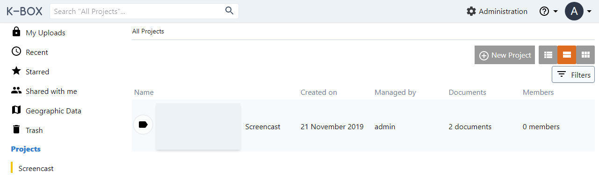

---
Title:Projects
Description: admin related documentation
---
# Projects

Projects help to create communities of users who share a common goal. Projects can contain files and collections, 
accessible by authorized users, unless explicitly stated otherwise.

Projects are created and maintained by Project Administrators and K-Box Administrators. Only one person can be a Project Administrator. Currently there is no way to transfer administrative rights to another person in UI.

## Projects section

Project management is performed from the _Projects_ page. 
If your profile has Project Management capabilities, 
you will see the _New Project_ button

The page lists the created, managed and accessible projects. 

## Create a new Project

To create a project, press the button _New Project_ that is on the top right of the page:

After inserting the project name, description and users, press the _Create Project_ to save your changes.

> Project name must be unique within the user's managed projects

## Project details

This page shows project members and personalization options.

This page is showed when you select _Details_ from the right-click menu of a project.

## Edit an existing project

To edit a project, press the _Edit_ button that is listed in the right-click menu. 
On the project edit page you can add and remove users from project. 

Save your changes, when finished. 

## Deleting a project

Currently a project cannot be deleted.

## Work with K-Box

For more information about the K-Box, check the [user documentation](../user/) folder.  

## Permission

A user can create a project if is assigned a project manager role. i.e. has the CREATE_PROJECTS capability.
The creator of the project, i.e. the project manager, is allowed to edit the project and add/remove members.

An administrator can see, edit and create projects created by other users.

A member of the project gains the following:

- possibility to create a collection;
- possibility to add a document to the project (or in a collection inside the project);
- possibility to remove a document from the project (or from a collection inside the project);
- possibility to trash a document that it is inside the project.

|Action               | Policy             | Comment  |
|---------------------|--------------------|----------|
|See projects listing | `viewAny(Project)` | The action of showing the listing of all projects (i.e. the projects page) |
|Get project content and/or details  | `view(Project)`    | With details we refer to the details panel |
|Create project       | `create(Project)`  | User can create Projects|
|Edit project         | `update(Project)`  | Change description, title, avatar and add/remove members |
|Delete project       | - |_not implemented_                    |
|See project avatar   | `view(Project)`    | Enables to see a project avatar in the list and on the details panel |
|Change project avatar| `update(Project)`  | |
|Remove project avatar| `update(Project)`  | |

The _policy_ column refer to the `ProjectPolicy` class in the code base, the name of the condition correspond to a defined method inside that class.

Definition of policies:

- `viewAny(Project)` The user is a member of at least 1 project or is a project manager or it is an administrator;
- `view(Project)` The user is a member of the project or an administrator;
- `create(Project)` The user has a project manager role, i.e. the `CREATE_PROJECTS` capability is set, or is an administrator;
- `update(Project)` The user is the creator of the project and has a project manager role, or is an administrator.
