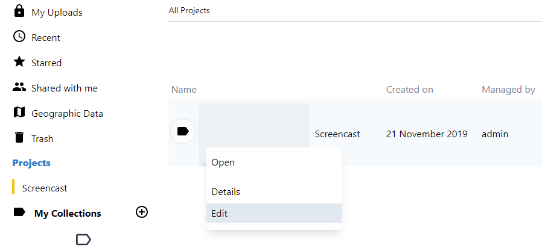

---
Title:Projects
Description: admin related documentation
---
# Projects

Projects help to create communities of users who share a common goal. Projects can contain files and collections, 
accessible by authorized users, unless explicitly stated otherwise.

Projects are created and maintained by Project Administrators and K-Box Administrators. Only one person can be a Project Administrator. Currently there is no way to transfer administrative rights to another person in UI.

## Projects section

Project management is performed from the _Projects_ page. If your profile has Project Management capabilities, 
you will see the _New Project_ button

The page lists the created, managed and accessible projects. 

## Create a new Project

To create a project, press the button _New Project_ that is on the top right of the page:

After inserting the project name, description and users, press the _Create Project_ to save your changes.

> Project name must be unique within the user's managed projects

## Project details

This page shows project members and personalization options.

This page is showed when you select _Details_ from the right-click menu of a project.

## Edit an existing project

To edit a project, press the _Edit_ button that is listed in the right-click menu. On the project edit page you can add and remove users from project. 

Save your changes, when finished. 

## Deleting a project

Currently a project cannot be deleted.

## Work with K-Box

For more information about the K-Box, check the [user documentation](../user/) folder.  

