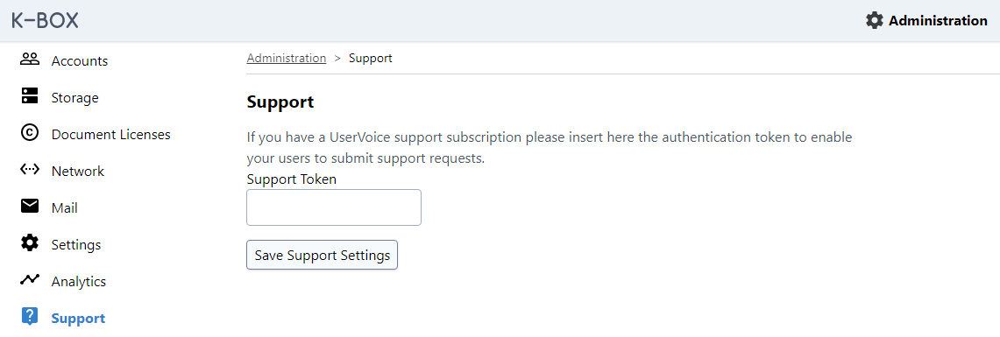

# Support

The K-Box can be configured to show links or use external services for providing support to users.

Currently the K-Box offers out-of-the-box support for [UserVoice](https://www.uservoice.com/).

## Uservoice

The Uservoice service will display an interactive widget on each page that allow the user to send immediate requests.

The K-Box will share the following data with UserVoice:

- K-Box application name
- K-Box version
- Route of page path
- Collection being browsed
- Search parameters

For logged-in users we will share also

- Email address (to receive responses and continue the inquiry)
- Username

> **When activating the UserVoice support service you should include the information of the service and the collected data inside the Privacy Policy**.

## Configuration via User Interface

The uservoice token and service can be configured from the _Administration > Support_ page.

> Removing the token from the UI will not disable the service if the environment configuration expose the support configuration

## Configuration via deployment environment file

The support service configuration is done via environment variables at deploy time.

The general configuration variables are:

- `KBOX_SUPPORT_SERVICE`: The support service provider. Possible values are: `null` (to disable the support), `uservoice`

Based on the selected service, more configuration options might be available.

**uservoice**

The UserVoice service require the following additional parameters:

- `KBOX_SUPPORT_USERVOICE_TOKEN`: the UserVoice token for the widget
