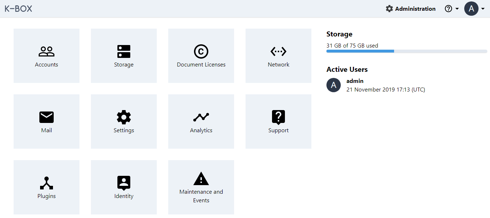

# Users management

The K-Box user management is based on [permissions](./permissions.md). 
To facilitate the user creation the permissions are grouped into three roles:

1. Partner: Can upload, edit and share files. Has access to shared Projects and Personal space
2. Project Manager: Has all _Partner_ permission, plus can manage projects and publish (or unpublish) data to the K-Link
3. K-Box Administrator: Has all permissions and can manage the K-Box configuration

> For all the available permissions, please refer to the [Permissions List](./permissions.md)


## User registration

The K-Box can be configured to accept user registration.
The user self registration will be available as a separate page under `/register`.
Links from the login page will be presented automatically.

The created accounts will have _Partner_ role.
After the account creation the user will be asked to confirm the email address.
As of now email verification can be skipped, but in a future version will be
enforced for security reasons.

To enable the user registration include the following line into the environment configuration

```conf
KBOX_USER_REGISTRATION=true
```

Once changed, if you are using Docker restart the instance, otherwise clean the cached configuration and routes

```
php artisan config:clear

php artisan route:clear
```

This is required to make sure visitors will be able to access the register page.

### Limit to invites only

Is also possible to require a person to have an invite before an account can be created.

To enable the user registration include the following line into the environment configuration.

To restrict the registration to person with an invite only set

```conf
KBOX_USER_REGISTRATION_INVITE_ONLY=true
```

Once changed, if you are using Docker restart the instance, otherwise clean the cached configuration and routes

```
php artisan config:clear

php artisan route:clear
```

## Create users

Users can be created from the Administration section.

> _Only administrators_ are entitled to create a new account for a user.



To add new user

1. From the “Administration” page select “Accounts”
2. Click on “Create user”
3. Fill in the email address, the username and select the role.
   If necessary you can set a password for the user and customize permissions or storage quota availability
4. Once done, click “Create” at the bottom of the page.

## Invite users

Already registered users can invite person via email address to join a K-Box instance. 
The invites are created from the "Invite" section under the user profile if registration is active for the K-Box.
To invite a person only his/her email address is required.

> To send an invite a verified email address is required. You will be prompted to verify your email address if needed.

> Invites are currently limited to account registration. Currently is not possible to invite users directly to
join project or to receive a share. Subsequent actions needs to be performed manually after the user 
accepted the invitation

**Registration workflow after invitation**

An invited user will receive a mail notification that contains a link to create an account. 
The link redirects to the registration page with a pre-filled invitation token. In case the link is not valid anymore
or expired a message will be given.

During the registration process the user can change the email address independently from the one used for the invite.
The invite creator will not see the change of the email.

After completing the invitation process, the creator of the invite will see a change in the status of the invitation.

**Validity**

An invite is not valid anymore if one of the following conditions are met:

- the invite was already used and an account was created
- the invite was older than 15 days (currently not configurable via environment variables or user interface)
- the invite was deleted by its creator
