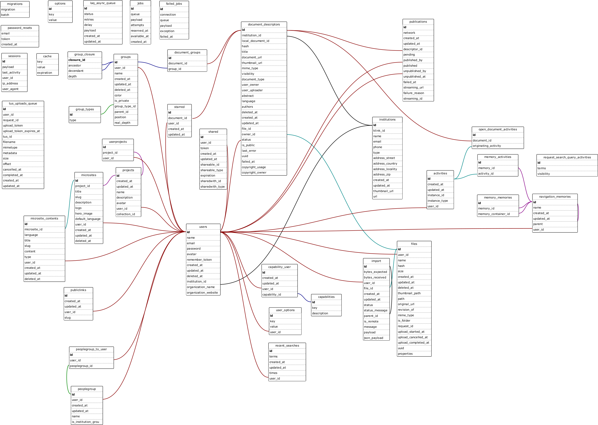

# Database Structure

[](./images/dms_project_db_entities.png)

The figure above shows the database structure of the K-Box. In the next sections a more in-depth comment on how some feature are implemented is reported.

Here the list of the main tables is proposed and described:

- *users*: stores the users
- *capabilities*: stores the default capabilities (see [User capabilities and Accounts](./user-capabilities-and-accounts))
- *institutions*: caches the institution locally
- *document_descriptors*: stores the document descriptors of the uploaded documents and the public document descriptor reference of starred public documents
- *starred*: stores the starred document descriptors for each user
- *files*: store the files metadata and link the logical representation to the filesystem
- *groups*: stores the collections:
 - `is_private` attribute indicate if the collection is Personal to the user or not. If not, w.r.t. K-Box edition, can be Institutional or Project
 - `color`: is a 6 digit field that stores the Hex Color value without the leading `#` character
- *group_types*: stores the different group types available. Group types values are stored at database seeding time. Possible values are:
 - `GroupType::GENERIC` : generic collection
 - `GroupType::FOLDER` : the collection was created starting from a physical folder on the filesystem
- *shared*: stores the shared document descriptors and collections
- *sessions*: stores the logged in sessions
- *failded_jobs*: stores the failed async jobs
- *laq_async_queue*: asynchronous jobs queue
- *options*: stores the global K-Box [dynamic configuration](./configuration)
- *user_options*: stores the user configuration options
- *recent_searches*: stores a users recent searches
- *password_resets*: stores the password reset requests
- *migrations*: stores the executed migrations over the database


The K-Box Standard and Project edition shares the same database structure except from the following tables and relations:

- *projects*: stores the projects details
- *userprojects*: handle the N to M relation between projects and user involved in projects
- relation user->institution by foreign institution_id on users: handle the institution affiliation of a user
- relation projects->users by foreign projects.user_id to users.id: this relation covers the fact that a project is managed by a single project administrator

## Users and Capabilities

Users are stored in the *users* table. The actions that every user can perform are governed by the concept of Capability and by the N to M relation between the *users* table and the *capabilities* table (*capability_user* table).

Each capability has a specific action (or set of actions) that authorize. An administrator account is an account with all the capabilities associated.

Conceptually a set of capabilities can be named as a user account type, and has been done so in the code to lower the configuration necessary for each account that need to be performed by the administrator. This capabilities set are totally logical and there is no account type stored.

For more in-depth discussion see [User capabilities and Accounts](./user-capabilities-and-accounts).


## Document Descriptor, Files and their versions

The *document_descriptors* table stores the metadata of the documents that are added to the K-Box and so indexed by the K-Link Search Engine.

> One Document Descriptor correspond to one physical file.

The physical files details (file path, thumbnail, original source,...) are stored in the *files* table. One file refers to a document descriptor and one document descriptor refers to a file, so you have a 1 to 1 relation from a document descriptor to it's physical file.

Under this condition the file versioning is possible enabling a single hierarchy level (parent-child association, field `files.revision_of`) on the *files* table. This hierarchy is totally transparent to the document descriptor. In other words the document descriptor is linked to the last known version of physical file. 


### Public and Private document descriptors

In the K-Link network there is the concept of Public and Private. By default all document descriptors are marked `private`.

A public document descriptor, inside the K-Box, is considered a flag of a private document descriptor. This means that a public document descriptor is still a private document of the institution, but has been opened for public viewing. In fact they both (public and private) shares the same meta data and, most of all, they have the same identifier, because it is the same document that will be showed for private and public requests.


### Deleting a Document Descriptor and a file

Document Descriptor and files deletion is implemented with the soft-delete technique. A field on each the table, called `deleted_at`, states if a user has deleted the document/file (i.e. if is null the document/file is not deleted, if is a timestamp the document is deleted at that point in time).

The soft delete realizes a trash. During the transition between available and soft-deleted the document descriptor is removed from the search engine.

The definitive deletion of a document/file could be tricky as it might have been shared, starred, included in one or more collection or have multiple versions. The physical removal of the document/file is done upon the trash cleaning. Trash cleaning cannot be undone and all the document relations are deleted.


## Groups

Groups/Collections are hierarchical structures to enable the high level mapping between folders and logical grouping of documents.

> Originally were called groups, but now are Collections

Groups are available at personal and institution level:
- institution level groups are visible to all the users
- personal groups are visible only to the user that has created them

The *groups*, *group_closure*, *group_types* and *document_groups* tables are responsible for handling the Collection concept inside the K-Box.

The *groups* table is the main entry point as it stores the collections details for each users created collection.

A group/collection can be added if the following uniqueness constraint is satisfied: 

```
unique(array('user_id', 'name', 'parent_id', 'is_private'));
```
Or in other words: a collection can be added if the user, specified by user_id, has not an already existing collection with the same name under the same parent collection that is private (or public). So a user can have two collections with the same name if they are under a different parent or if they are respectively private and public


The Collection hierarchy implementation is done using the [Closure Table](https://coderwall.com/p/lixing/closure-tables-for-browsing-trees-in-sql) pattern.

The current implementation rely on the [Jan Iwanow Closure Table](https://github.com/franzose/ClosureTable) implementation for Laravel. 

Other closure table reference:

- http://www.percona.com/blog/2011/02/14/moving-subtrees-in-closure-table/
- http://www.slideshare.net/billkarwin/models-for-hierarchical-data (slide 69)

***Private vs Public***

Historically the collections were considered private and public from a users point of view. This distinction refers to the fact that private collections means that only the user that has created it can view it (and manage it), while public collections can be viewed by all the institutions users.

In this way the concept of Personal Collection (aka My Collections) and Institutional Collection was implemented. As the introduction of the Project Edition the Institutional Collections have been removed and re-purposed to Project Collections. Project Collections are collections that belongs to a specific project. The `is_private` attribute has two different meanings, based on the K-Box edition:

- `is_private === true` means user personal on both edition
- `is_private === false` means Institutional collection in the Standard Edition and means Project Collection in the Project Edition

In the Project edition a Project is forced to have only one root project collection, i.e. a collection that don't have a parent collection.

**Deleting a collection**

Given the fact that a collection is a complex hierarchical structure the soft delete technique is used. This technique enables to have a trash which takles the errors of the users when wrongly deleting a collection.


## Project Concept

The Project concept has been introduced to represents the case in which two or more users, from different Organizations, collaborates to a realize a common set of documents, maybe in response of a the creation of a joint Project. 

Project details, such as name and description, are stored in the *projects* table along with the project manager of the project itself (field `projects.user_id`). A project can only have one project manager and the current implementation don't enable to ability to change it.

Every project can have multiple user involved, this relation is handled by the pivot table *userprojects*. Of course, the same user could be involved in different projects

In addition, to introduce, the affiliation of a user to a specific Organization/Institution, the relation between the tables *users* and *institutions* has been created. One user can belong to an institution and an institution can have multiple users.

**Deleting a Project**

A Project cannot be deleted.


## Sharing

Sharing of documents and collection is realized with the help of the *shared* table.

In this table there are two [polymorphic relations](https://laravel.com/docs/5.7/eloquent-relationships#polymorphic-relationships):

1. `shareable`: the shared element, could be an instance of *document_descriptor* or a *group*
2. `sharedwith`: with who I'm sharing something. Can be a *users* or a *peoplegroups* instance


## Database to PHP Class and Database table construction

The mapping between database tables and PHP classes are handled by [Laravel Eloquent](http://laravel.com/docs/5.7/eloquent). All the models that pertain to a database table is stored in the `app` folder in the source code.

The database tables are created using [Laravel's migrations](http://laravel.com/docs/5.7/migrations). The source code is stored in the `database` folder.

