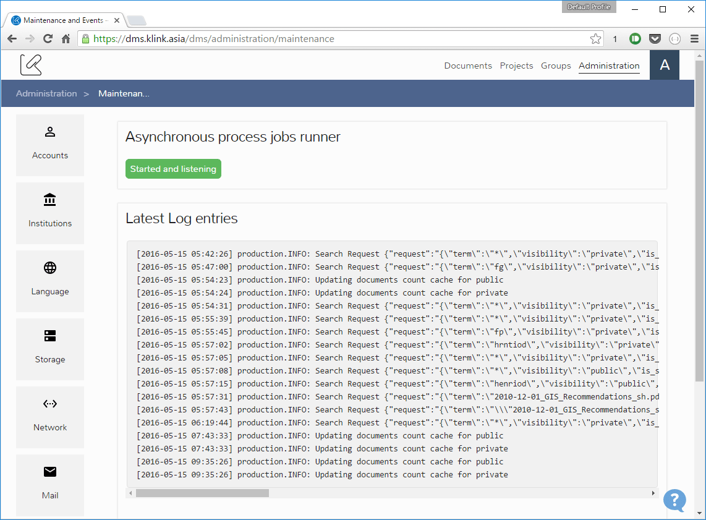

# View Logs

The DMS saves a log file for each day. Log files older than 5 days might not be available.

The log file of the current day can be viewed from the DMS `Administration > Maintenance and Events` page. The page is similar to the one showed below


 
The Log file is a big chunk of text on which every line starts with a timestamp (e.g. `[2016-05-15 05:42:26]`). 
Timestamps report the time according to the timezone specififed in the DMS configuration.
 
Considering that the DMS is a beta product the log file can be very big as it stores information messages, warning and errors.
 
You can distinguish between the different types of messages because of the `production.` statement in the log entry:
 
- `production.INFO`: something that is informative about an action
- `production.WARNING`: something we want to monitor
- `production.ERROR`: errors, mostly Exceptions that are showed to the user as problems in performing the actions they wanted to do
 
Log entries can contain text or text and a json encoded payload with context informations.
 
For example the following log entries refers to the update of the total documents cache (both public and private) 

``` 
[2016-05-15 05:54:23] production.INFO: Updating documents count cache for public  
[2016-05-15 05:54:24] production.INFO: Updating documents count cache for private
```

This entry shows a search request

``` 
[2016-05-15 06:49:31] production.INFO: Search Request {"request":"{\"term\":\"*\",\"visibility\":\"private\",\"is_search_request\":false,\"page\":1,\"limit\":12,\"filters\":null,\"facets\":null,\"on_collections\":[\"0:756\",\"0:756\"],\"in_documents\":null,\"url\":\"https:\\/\\/eba.klink.asia\\/dms\\/documents\\/groups\\/756\",\"query\":[]}"}
```

This kind of entry is used to identify fixed point in time where a user has browsed a section under documents or has performed a search.

In the list of common log messages there is the space for documents actions

```
[2016-05-15 07:00:07] production.INFO: DocumentsController store {"request":{"document_fullpath":"undefined","document_name":"omitted-for-privacy",...})"} 
[2016-05-15 07:00:07] production.INFO: Core indexDocument - before saving DocumentDescriptor {"context":"DocumentsService","attrs":{...}} 
[2016-05-15 07:00:08] production.INFO: Core indexDocument returned descriptor for 5033 {"context":"DocumentsService","response":"[object] (KlinkDocumentDescriptor: {\"institutionID\":...})"} 
``` 
The previous code block shows an example of log entries related to the upload of a new document. The reported context information includes: document names, identifiers, user that has performed the action and document descriptor value. 

When an error happens, like in the example of the next code block, the Exception is reported in the log entry (the log entry has been divided on multiple lines for explanation purposes).

The code block shows a thumbnail generation error for a Power Point presentation.

```
[2016-05-15 07:00:10] production.ERROR: Error generating thumbnail {
    "context":"DocumentsService::generateThumbnail",
    "param":{
        "id":4998,
        "user_id":26,
        "name":"filename.pptx",
        "hash":"2c80",
        "size":139138,
        "created_at":"2016-05-15 07:00:07",
        "updated_at":"2016-05-15 07:00:07",
        "deleted_at":null,
        "thumbnail_path":null,
        "path":"...",
        "original_uri":"...",
        "revision_of":null,
        "mime_type":"application/vnd.openxmlformats-officedocument.presentationml.presentation",
        "is_folder":0
    },
    "exception":"[object] (KlinkException(code: 500): Internal Server Error at /var/www/dms/vendor/klink/adapterboilerplate/klink/KlinkCoreClient.php:919)"} 
``` 

Although the error is logged the DMS shows a standard image as the thumbnail of the file. This log entry give to the developers the information about which document 
raised the problem and the kind of exception. In this case the exception `KlinkException(code: 500)` indicates that the problem must be further investigated in the 
K-Core component and is not related to the DMS itself. 
 