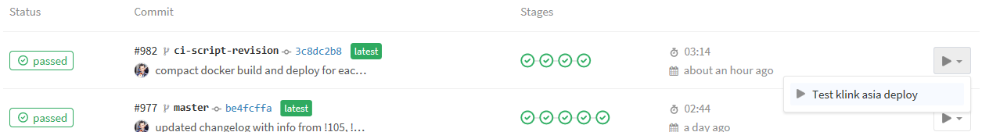
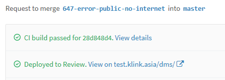
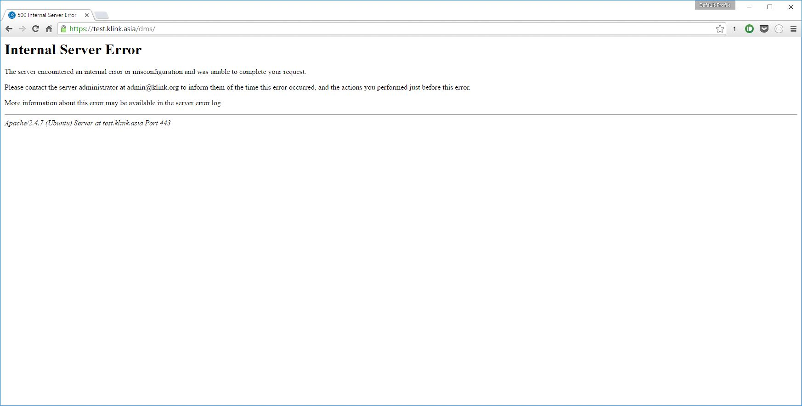

# Test instance

The K-Link K-Box can be tested on a specific test instance, available at https://test.klink.asia/dms/

The test instance always start with a fully empty and non-configured K-Box. 
This mean: no mail configuration, no institution, no documents, default settings and only one user.

The only way to login is to use the `admin@klink.local` account. 
For security reason the password is not written here, please ask it in 
the [`#dev` channel on Slack](https://k-link.slack.com)

## Fair usage of the Test instance

The test instance has been created in order to test a feature before it can be added to the current 
development status of the next release, which happen in the `master`. 

Is very important to remark that **Only one source code branch can be tested at each deploy**. 

If someone triggers a new test you will loose your work on the test instance.

## Triggering the test instance for a source code branch

The reload of the test instance with the code of a particular branch can only be performed 
by registered developers.

Every registered developer can "play" the build from the [Pipelines section in GitLab](https://git.klink.asia/klinkdms/dms/pipelines) 
or from the specific merge request you want to test. In the merge request you can trigger the 
deploy from the Builds tab.

On each branch the `deploy` stage is executed only if the "Play" button is pressed. On branches the only 
available option, under the Play menu, is `Test klink asia deploy` 

Pressing play will build and deploy the code on the [Review Environment](https://git.klink.asia/klinkdms/dms/environments). 
The rewiew environment can be browsed on https://test.klink.asia/dms/

When a build is triggered inside a merge request, Gitlab, will show a message like the one below. 

## Connecting to the instance

The build time could vary between 20 to 40 seconds, but the instance might not be fully available until a couple of minutes.

If you see a screen like the one below when connecting to https://test.klink.asia/dms/ means that the all K-Link is still starting. In normal conditions requires a couple of minutes. Periodically refresh the page until you see the usual login screen.

If the screen above persists after 5 or more minutes contact the #dev team.
