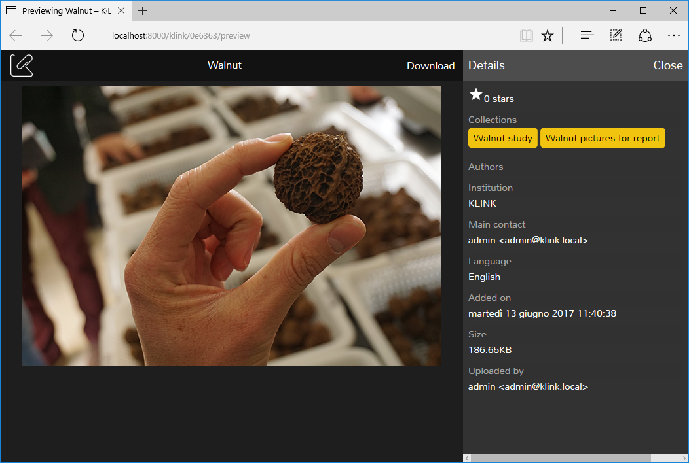
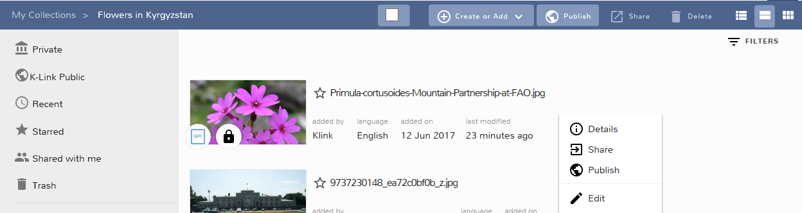

Welcome to the June 2017 release of the K-Box. There is a small set of updates in this version that we hope you will like:

- Preview screen improvements
- Publish button changes
- Sharing dialog translated to Russian

### Preview screen improvements

The document preview screen has a better look. It now uses a darker mode, to better show images and Power Point 
presentations.

Now it is possible to see the document details on the preview page. Clicking on the collection, you can navigate to its location like in
the details panel in Documents section.

In addition, we enhanced the Power Point preview with a better support for 
the layout of your presentations. In most of the cases images inserted within the slides, or the template, should now 
be displayed.

_Experimental area_

We are adding Spreadsheet support, therefore with this version we want to give you a sneak peek on what we are working on.

The spreadsheet preview is available for files with `xlxs` as extension

### Publish button changes

Some users reported being stuck in the action of making a document public on the network. This happened mostly because 
the Publish button, on the right click menu, was visible even if user didn't have the permission to make a 
document public. Now the Publish button is visible only to administrators who have the ability to publish on the K-Link Network. Other users will not see it anymore.

### Sharing dialog translated to Russian

The sharing dialog introduced in the previous version is now fully available in Russian.

### Other notable changes

- Adding a shared document to personal collection is now possible
- Fixed a case that could generate a redirect loop to the same page even if you want 
  to navigate to the K-Box home page

