Welcome to the September 2017 **K-Box** release. There are a number of significant updates in this release that we hope you'll appreciate.

**And yes, now the K-DMS is called K-Box**

**tl;dr**

- Updated user interface with new document listing layout
 - column labels in details view
 - name of the user that uploaded a document version
- Enhanced small screen support
- Thumbnail for video files
- Login remembering
- Unified search for all

### User interface

The user interface layout and colors have been totally revised according to the K-Link brand styleguide.

There are immediate notable changes around the colors, the images and the iconography, but also details worth mention.

The colors have upgraded to use the K-Link brand selection. The colors have been selected to increase the legibility of the text and to respect the contrast rules for accessibility.

Also the typography has been touched to increase the readability of all the messages accross different devices and supported languages. 

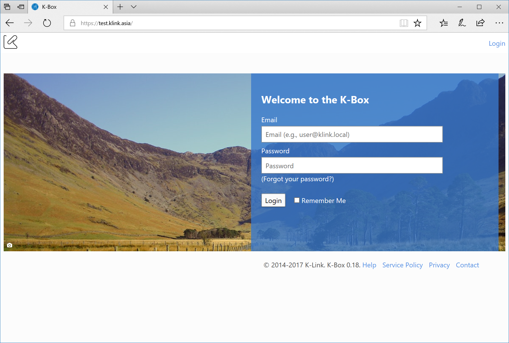

#### Updated document layout

The presentation of documents has been revised. The details view now has column headers to better understand the meaning of the information.

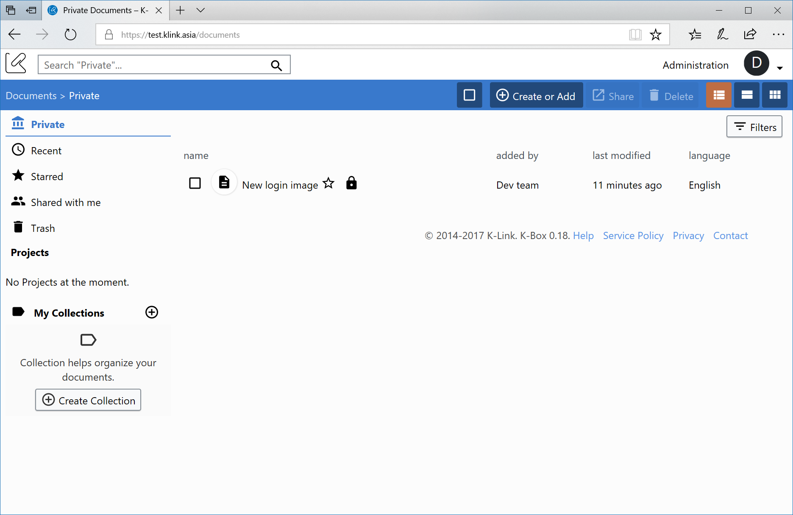

In addition the grid view put the various icons right below the document title, instead on hover and on the thumbnail.

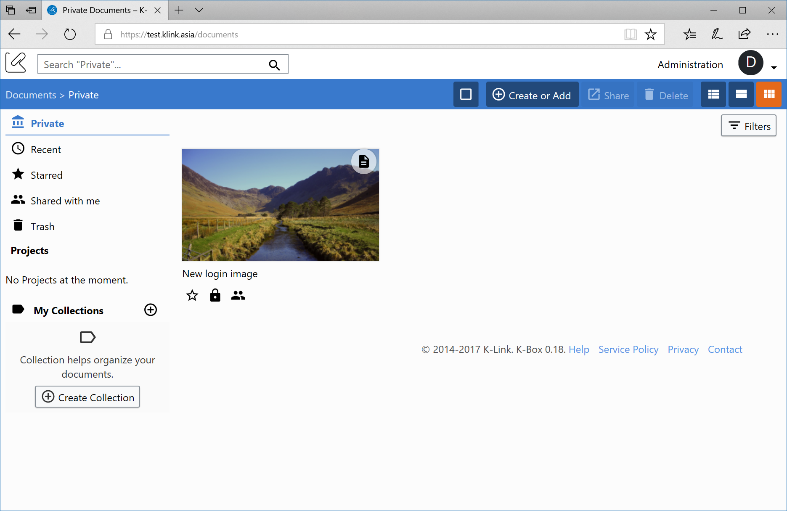

Oh, yes, we added a share icon if the document is shared.

#### Better support for small screens

In an ongoing effort to make the K-Box usable on devices with small screen, we made the sidebar navigation collapsing. 

If the browser window with is small the sidebar will be automatically hidden and a _three line menu_ will be shown near the breadcrumb navigation. Clicking on that button will show (and hide) the sidebar navigation.

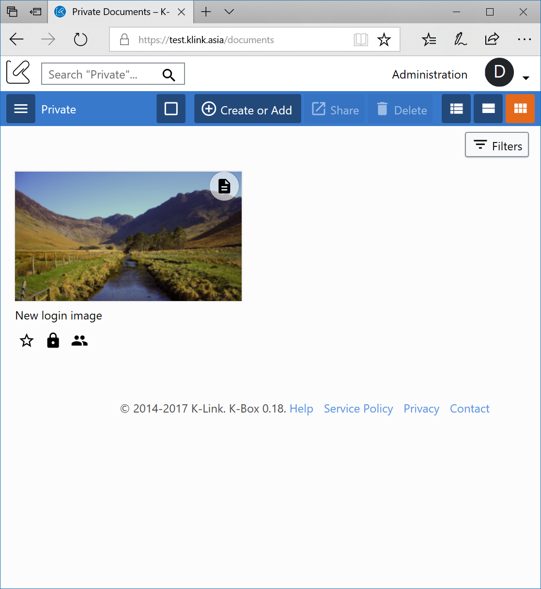

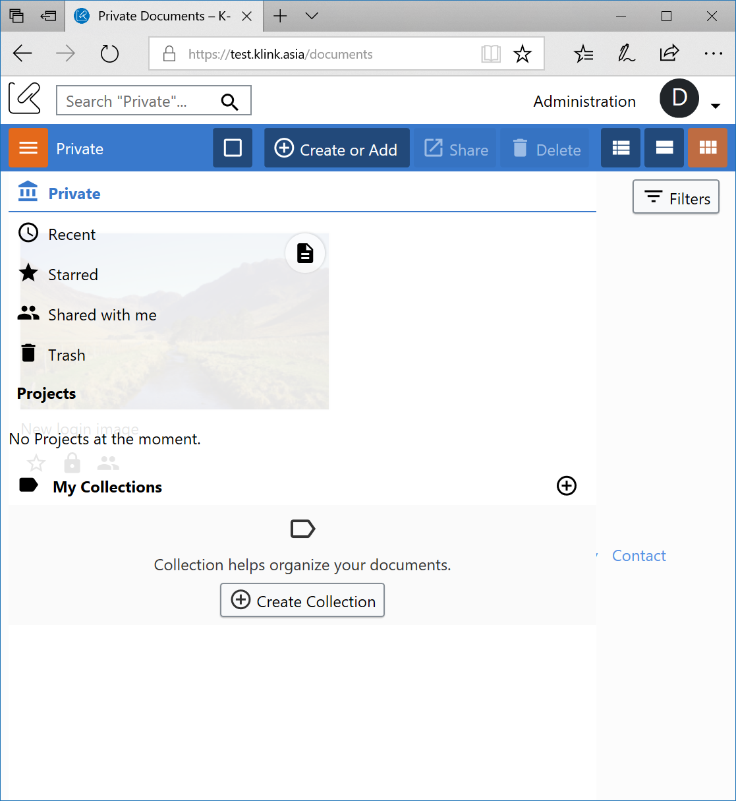

#### Thumbnail for video files

On the previous version you were allowed to upload videos, but the thumbnail was not representative of the video content. Now for mp4 video files (encoded using H.264 codec) a proper thumbnail will be generated.

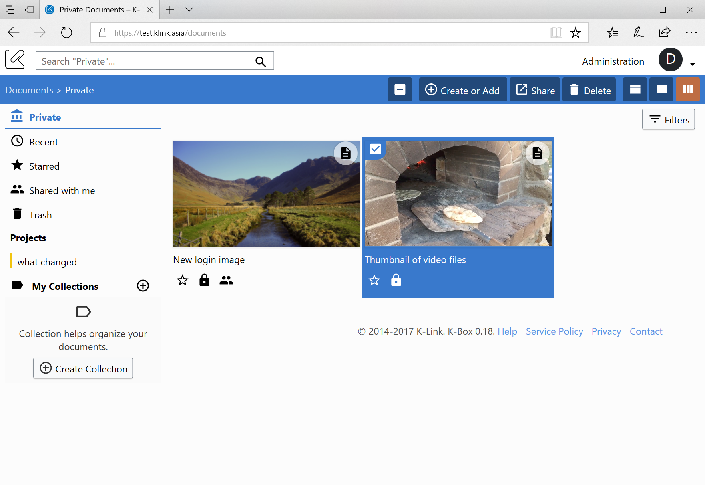

#### Who uploaded a document versions

A quite number of person were asking about the possibility to know which user uploaded a document version. We listened and now is available.

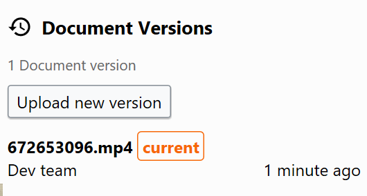

### Remember me on login

For more than one time users asked to be relieved from always writing the username and password to access the K-Box. We finally listened and the login page now supports the "Remember me" functionality. Your login information will not be asked for 30 days. Beware that in case of upgrades you might be asked for inserting the email and the password for security reasons.

### Simplified global navigation

The global navigation has been greatly simplified. Now there are only two areas, the document section and the administration section. If you're not an admin you will see only the document section. Clicking on the K-Link logo will bring you back to the documents section.

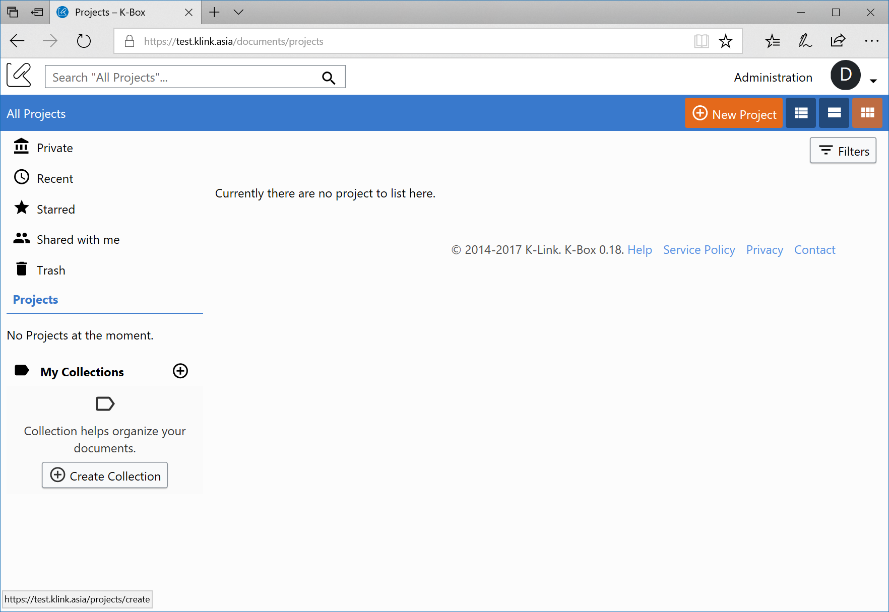

The project management section has been merged into the document section. It is reachable from the "Projects" item on the sidebar. If you have enought permissions the option for creating projects will appear on the action bar. Editing a project is possible from the projects details panel or from the right click menu.

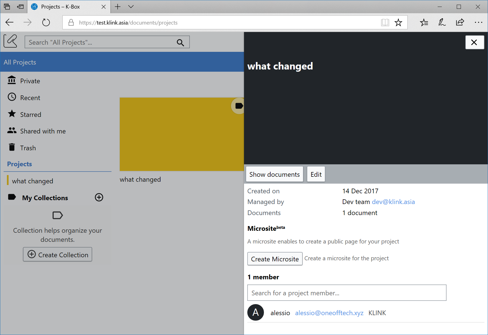

### Unified search

The Unified Search enable to search accross all projects from a single location. This feature was tested by users of the Ecosystem Based Adaptation project for about a year and now is available to all users.

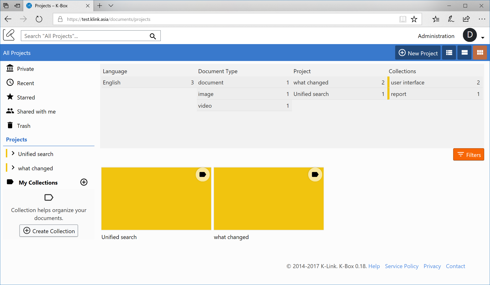

One of the Unified search main additions is the _Project_ column in the filtering options. This option let you see how searched documents are distributed around projects.

A second important feature delivered with the unified search is the ability to see, on the Recent page, the documents added or modified accross all project. Plus the option to filter and sort the recent document by date.

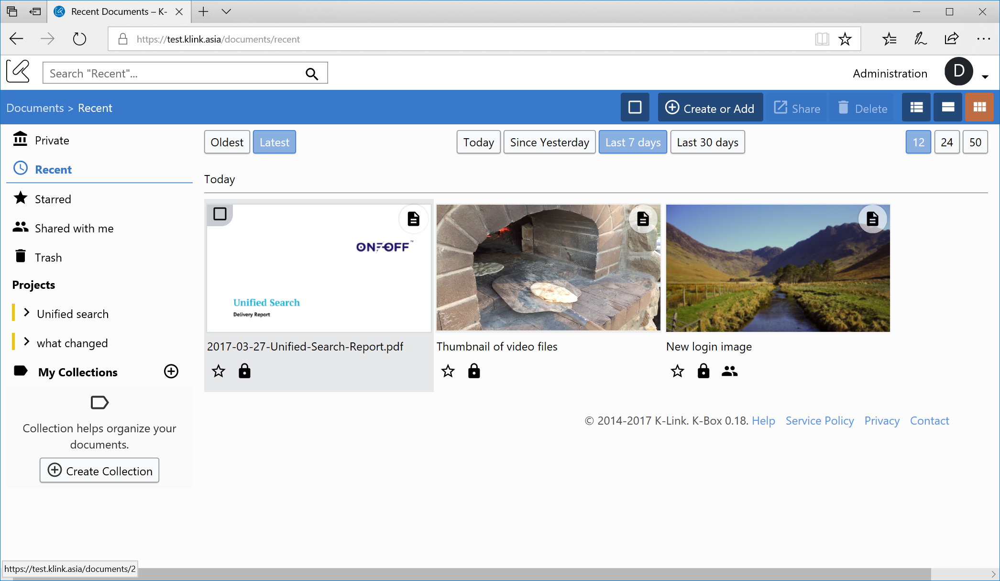

In addition the recent page now offer the option to select how many documents will be shown per page.

### Other notable changes

- The avatar letter now respects your usage of Cyrillic characters for the username
- Starred icons behavior change: now the icons are only two, one for starred and one for unstarred. The starred variant is colored in yellow
- Login page and welcome page are now the same, no more difference in layout and content
- Collection removed message is not shown anymore when a collection is removed from the document details panel

### Notice for browser support and future versions

#### Browser compatibility

In order to keep the K-Box up to date with the latest changes in the browser ecosystem, Internet Explorer 9 is not supported anymore, while Internet Explorer 10 is supported on best effort. This respect the Microsoft policy of supported browsers. We encourage to update to Internet Explorer 11 (if you are on Windows 7/8.1) or use Microsoft Edge, if you are on Windows 10.

#### Removal of unused features

After long thinking and analysis we found the the Group feature was not used. The group feature allowed to generate group of users to easily share the same document to multiple users. The change to the sharing dialog introduced in the previous version has made the feature obsolete. Therefore in this release the option for creating and managing groups has been removed. Already created groups will keep working until the next release, where they will be migrated to direct share between users.

#### Deprecation notice

In this release some features are deprecated and will be removed from future versions:

- Import from URL functionality is deprecated and will be disabled with the next version 
- Institution management will be deprecated and disabled from the next version 

