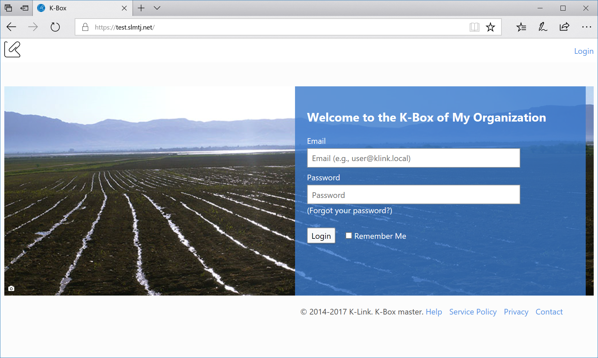
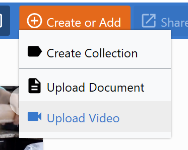
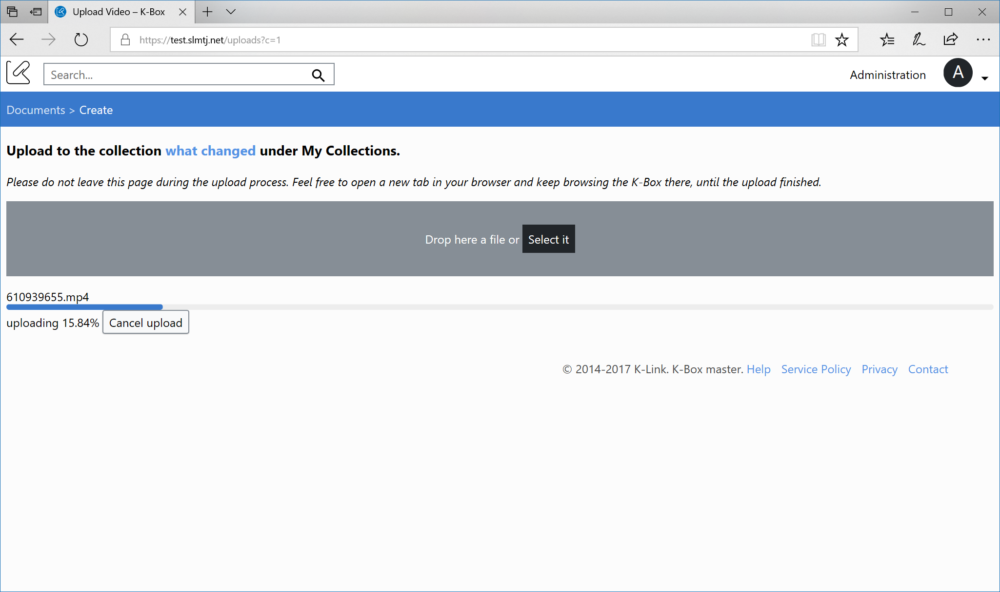
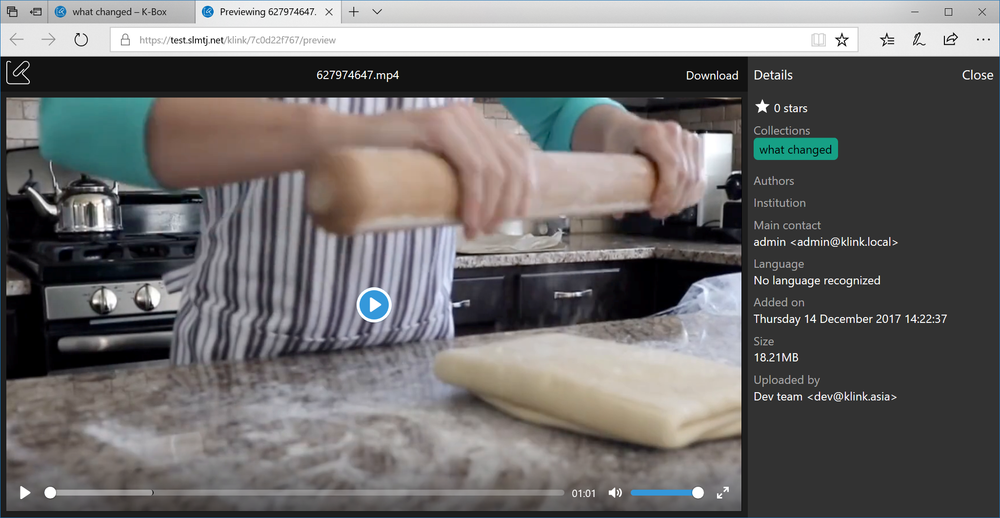
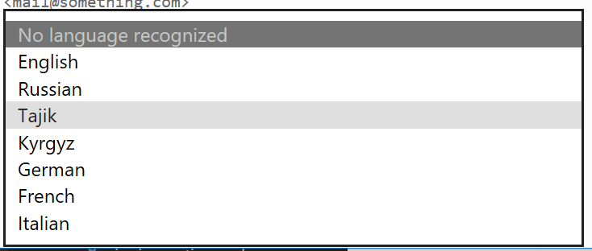
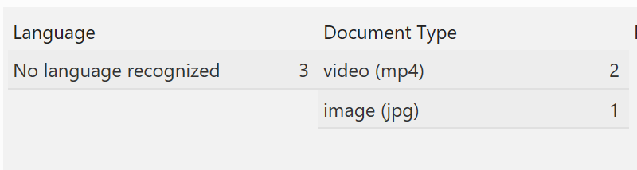
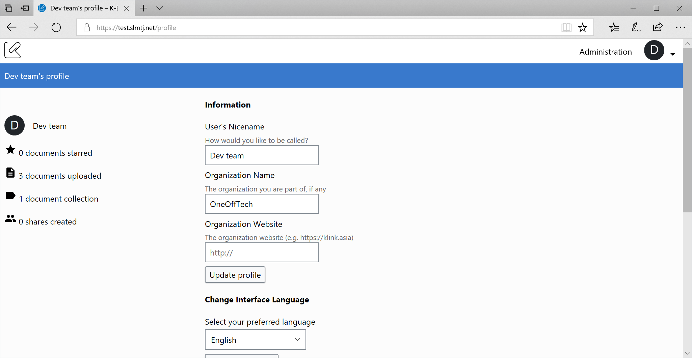

Welcome to the December 2017 release of the K-Box. This release, among all other changes, include better video support and different requested features.

### Organization name on the login page

The login screen has a new background image submitted to us by Yuri Skochilov of the Youth Ecological Centre. Thanks Yuri.

In addition the name of the organization, if configured in the identity section, is displayed.

### Video uploader

Enabling a full support for videos means giving a better way of upload video files. Video files can have a very big size in comparison with PDFs.

The new uploader is reachable from the "Create or Add" menu and will be opened in a different browser tab. This will enable to keep navigating the K-Box on the previous tab, while videos are being uploaded.

The uploader will clearly show in which part of the K-Box the file will be uploaded. It can be a collection, a project or just in your personal files. 

The video uploader supports a resume mechanism that enables to retry the upload, without losing the part already uploaded, in case the network connection to the K-Box drops (for this to be effective you should not close the browser tab). 

The uploader supports also the cancellation. If you wrongly started to upload a document, you can now press cancel and the upload will be stopped and the data will be discarded.

Once an upload is finished, the button "Open File location" will appear. Clicking on this button will navigate you to the exact location of the file upload.

### Video playback

Enhancement the video upload automatically means that also the playback of the uploaded video is impacted. With the increased use of videos and the quality and resolution they are created it was important to deliver a better playback experience.  

Video playback can use lot of resources, especially for Full HD videos. For mp4 video (encoded with the H.264 codec) the playback is delivered using the [Dynamic Adaptive Streaming over HTTP](https://en.wikipedia.org/wiki/Dynamic_Adaptive_Streaming_over_HTTP) (DASH) protocol.

The DASH protocol enables players to switch the video quality of the playback according to bandwith and connection type. Currently this operation is done automatically by the player, like the Auto mode on Youtube.

**Supported video formats and resolution**

The minimum resolution supported is 480x360 pixels. The maximum supported resolution is 1920x1080 pixels.

The original video should be a mp4 video encoded with the H.264 codec with AAC or MP3 audio, other formats will not be reproducible.

**Supported browsers**

The dynamic playback is supported on the following browsers

- Internet Explorer 11
- Microsoft Edge
- Firefox 49+
- Chrome 62+
- Safari 10.1 (on Mac OS)
- Chrome (latest) on Android 
- Firefox (latest) on Android
- Android stock browser on Android 5.0+

**Unsupported browsers**

For the unsupported browsers the original video file will be served. The list of unsupported browsers currently include Safari on iOS and Internet Explorer 10 (or below).

### Language recognition

We added the support for Tajik language recognition of file content.

In the past we would have assigned the English language to files we where unable to properly identify the language. Now we don't set any language explicitely.

### Filter enhancements

Sometime the document language cannot be automatically recognized, therefore files might not be taken into consideration for filtering. Now we added, in the language filter, the ability to retrieve documents whose language has not been recognized. 

In the past the document type categorization tried to reduce the number of categories by grouping together different formats, for example PDF and Word document ended-up in the generic document category. This has generated problems in finding a specific Word document, for example. Now the document type filtering take into account the real type of the document, so you can filter for PDF, Word documents and other type of documents.

### Organization in user profile

In an ongoing effort to make the user manager simpler and effective for all organizations, we relived the K-Box administrator from inserting the user's organization. Each user can now specify the organization they are affiliated with from the Profile.

Users already created and associated to an institution will have the organization fields pre-populated. 

### Video publication on a K-Link Network

The K-Link Network now support the upload of video files, therefore the K-Box now supports the publication of video files too.

### Other notable changes

- The Help page has now more questions answered.
