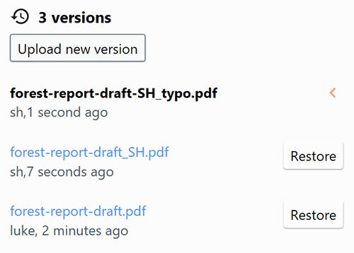
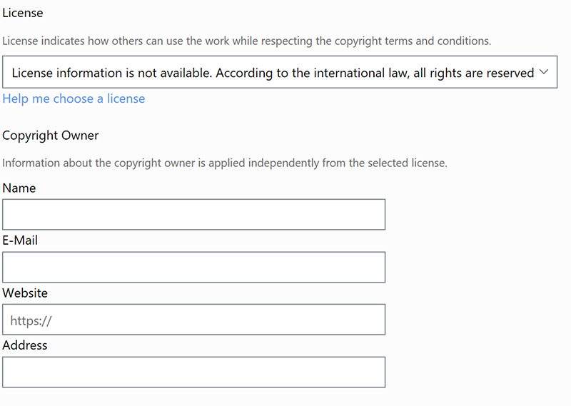
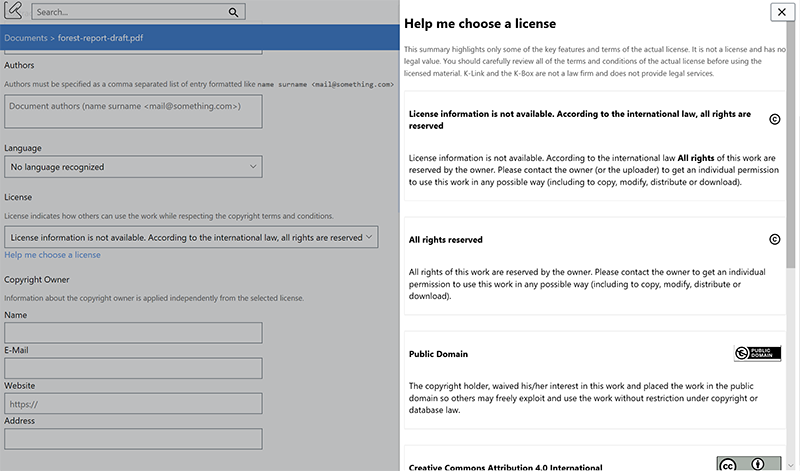
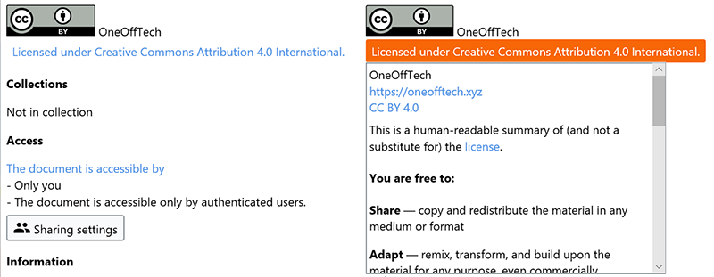
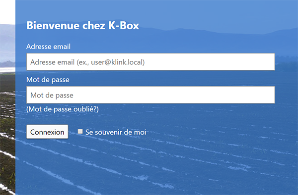

Welcome to the February 2017 release of the K-Box. This release, among all other changes, includes two new features.
One feature was requested by the community.

- [Restore old versions](#access-old-versions-of-a-document)
- [License + copyright](#copyright-and-license-management)
- [French translation](#french-translation)
- [Password changes](#password-requirement-changes)
- [Other changes](#other-notable-changes)

### Access old versions of a document

The feature [was requested](https://klink.uservoice.com/forums/303582-k-link-dms/suggestions/16267207-make-old-version-of-documents-accessible) by users as an improvement of the document version experience.

You can preview and download older versions of a document from the Edit page. 

If latest version was uploaded by mistake, you can restore a previous version. This will, however, delete all newer versions.

### Copyright and License management

We value everyone work, so we are slowly introducing a more fine-grained control over the Copyright Owner information, as well as the ability to specify what other users can do with your work (license).

**Copyright owner**

The copyright owner is often the creator of the document unless stated otherwise. It is possible to leave the fields empty, if information on the copyright owner is difficult to obtain.

**License**

The license defines how a document/work can be used by third parties. Following international guidelines, if no license is specified, documents will be considered as protected by the copyright law.

If you want to explore more about terms and conditions of licenses available in your K-Box, we include a help section that presents their short summary and links to original sources.

**Details panel changes**

License and copyright information are presented on the document details panel (for both private and public documents).

A shortline with the logo of the license, the copyright owner, and the license name serve as an introductory element.
Clicking on the license name will open a small help message that presents all the available copyright owner information, the link to the full license and a short descriptor of what the license grants. 

**Publication on the network**

The Copyright and license information are not yet required to publish a document on the K-Link network.
By default, the documents without an explicit license will be considered as protected by the copyright laws.

**Related material if you want to know more about Copyright**

- [Larry Lessig and how the copyright law is strangling creativity](https://www.ted.com/talks/larry_lessig_says_the_law_is_strangling_creativity) (_video_)
- [What Copyright infringements means (YouTube Copyright School)](https://www.youtube.com/watch?v=InzDjH1-9Ns)
- [Design & Copyright - Making sure your work is legal](https://www.youtube.com/watch?v=K8P12a84msg) (when someone else work is used)

### French translation

We are thrilled to announce that a community member contributed to the translation of the K-Box User Interface in French. Hope that French speakers will appreciate.

### Password requirement changes

To increase the security the minimum password length is now 8 characters.

This will be enforced the first time a password reset is requested, or when the password 
is changed from the Profile page.

### Other notable changes

- The preview page layout has been improved, especially for mobile devices
- The video player UI does not interfere with the playback
- The document update date in Russian should now be properly displayed, sorry for that
- IE 11 users might have experienced problems in logging out, now it should work as expected
- The field "Uploaded by", on the details panel, now can include information about affiliated organization of the uploader
