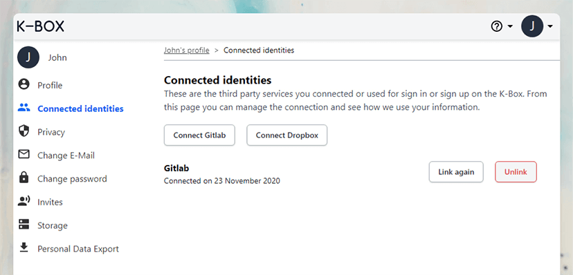

## Log in and register via external providers 

In this release we introduce the possibility for your users to log in and register
using Gitlab and Dropbox accounts. 

A user can connect the external services also to an already existing account.
Doing so will enable to log in with the connected services.

_It is important to note that this option is configurable and not enabled by default on all K-Boxes installation._

## Other improvements

- Allow project creation from the sidebar
- Quickly copy the link to a document, collection or project from the detail panel

## Deprecation and removal

**Internet Explorer 11 support**

Version 0.32 will be the last to support Internet Explorer 11 or below, 
we suggest to use Microsoft Edge, Firefox, Google Chrome, Opera or Safari. 

Removal date: **January 2021** (version 0.33).

**Video and document uploader**

Currently the K-Box offers two separate upload mechanism, one for documents
and the other for videos. The video uploader is now deprecated, the
preferred way to upload files is to use the drag and drop or the 
_Upload document_ entry (under Create or add). The next version
will unify the labels.

Removal date: **January 2021** (version 0.33).

**Project microsites**

Microsites have been deprecated, and moved behind a switch, since version 0.29.
Microsite feature will be removed in the next version due to usage and
security concerns. If you are not using the feature we suggest to make 
sure it is disabled. If you are actively using it we suggest to not
use the option to show content from RSS.

Removal date: **January 2021** (version 0.33).

_If you are a developer or a maintainer, please have a look at the [changelog](../../changelog.md) for a complete list of changes._
