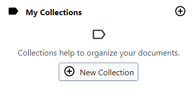

## Collections

Collections are the K-Box way to group files together. Even if the
grouping is not required to browse files, it can help you
categorize the files for immediate retrieval.

**Differences between folder and collections**

You may instinctively compare Collections to folders (as you find on Windows, MacOS and other Operating Systems). Although they appear 
similar we gave _Collections_ some more power:

- You can assign your document to more than one collection 
- Files are not copied inside the collection, but linked. This means that a file stays the same even if added to multiple collections.

You might see _Collections_ as logical grouping of files.

Collections do inherit some properties of a folder:

- Collections are hierarchical, so you could have parents, siblings and childrens
- You cannot have two collections named equally in the same hierarchy. For example you cannot have to equally named colledtions under the same parent, as happens for folders

**My Collections vs Projects**

Users can organize files in My Collections according to their preference, as the created collections are private. Private collections are colored green for distinction from project collections (yellow).

Projects are shared spaces. They do support creating collections inside too. Collections inside a project are usually referred as _project collections_.

## Creating collections

You can create collection in two ways:

1. From the action bar, using the "Create or add" menu
2. Using the right click (or context) menu on the sidebar

For private collections there is also a _plus_ button near the "My Collections" label you can use to create a root collection.

## Add files to a collection

Adding files to a collection can be achieved via drag and drop. You can drop a file directly to the name of a collection to upload it in the particular collection. For already uploaded files you can drag and drop them over a collection name. Multiple selection is also supported.

## Remove files from a collection

To remove a file from a collection click on the file to get an overview of all assigned collections. Hit the “X” symbol near a collection label to remove the collection.

### Trashing collections

As happens for files, collections can be trashed too. Trashing a collection
means that the collection and the eventual sub-collections are moved to the trash. Files that were in the collection will be moved out, but not trashed. In other words you are trashing a custom organization of the files, not the files themselves.

### Restoring from trash

Restoring a collection from the trash restores the collection and the eventual children.

> Currently the restore will not re-attach files that were previously categorized in those collections
