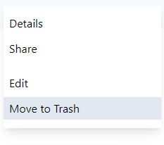

## Delete file

If you want to delete file, do a right click on the selected file and click on "Move to Trash" option. This action also available from [upper navigation menu](./index.md).

Depending on your [permissions](./trash.md#trash-behavior), you can fully remove files from [Trash](./trash.md) section, restore them. 

