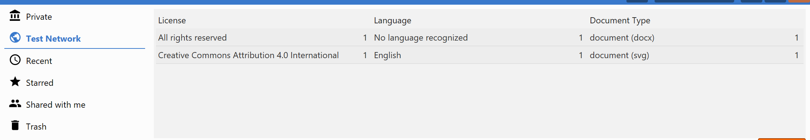

#### Previous: [Identity](../administration/identity.md)            

# License and Copyright

We value everyone work, so we are slowly introducing a more fine-grained control over the Copyright Owner information and the ability to specify what other users can do with your work ([license](#license)).
Without the explicit indication of the licenses, there is a danger of infringing the ownership rights for the content on K-Link Network and the K-Boxes. In order to protect K-Link users and participating organizations against lawsuits, it is important to state the copyrights and license to inform users about the potential allowed uses for the contents. 

### Copyright owner

As a general rule, the copyright over work is initially owned by its creator. This is not always the case. For instance, if an author wants to publish their manuscript in a journal, they will have to conclude a publishing agreement. 

According to the agreement, author transfers copyright to the publisher and will be capable of disseminating the original manuscript for non-commercial purposes only.

A concrete example of the policy is presented on the [Elsevier](https://www.elsevier.com/about/our-business/policies/copyright) website.

Users can provide the following information about the copyright owner:

    • name

    • email

    • website

    • address

Information about the copyright owner is applied independently from the selected license. 

### License

License provides information about the terms and conditions for a document/work use by third parties as specified by the copyright owner. Licenses help to protect the work from copyright infringement. Due to their legal value, they also allow the copyright owner to avoid giving use permissions on case by case basis.

At the moment, one can select the following options for their contents in the K-Box:

1. All rights reserved
2. Public Domain
3. Creative Commons 4.0 (and its derivatives)
4. No license information available

_Details panel_
License and copyright information are presented on the document details panel (for both private and public documents).

A short line with the logo of the license, the copyright owner, and the license name serve as an introductory element.
Information about copyright and license will be presented right below the title and the star counter on the document details and preview pages. 

_Filters_

The filters for public networks will also include licensing information.

### When should I indicate a license or copyright owner information?

The copyright owner and license information should be indicated as soon as a work is shared, or disseminated with other users through K-Box. It is strongly recommended to add that information before a work is shared in a public space.

Copyright and license information can be changed from the [_Edit_](https://git.klink.asia/main/k-box/blob/Update-Help-Project-section/docs/user/documents/upload-edit.md#edit) page

### Custom license

If you miss a license, which is not listed under available options, contact K-Box Administrator and provide as much information as possible about it.

#### Back to: [Overview](./work-with-documents.md)            
