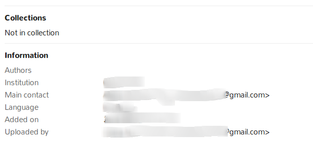

## Meta-data
When a document is uploaded, information about it is gathered. It is called
meta-data. The information available is usually:
* Collections to which the document is assigned
* Its author or authors
* Its main contact
* Its language
* Date it was added
* Uploader

By clicking on a doc, it is possible to consult this information:

## Previous: [Overview](./work-with-documents.md)            

## Next: [Upload and Edit files](./upload-edit.md)