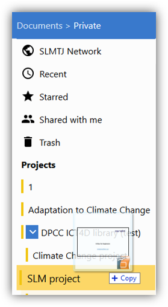

## Upload

To add a new document, select the collection or sub-collection in which the document will be stored.

There are several options for uploading a file into K-Box:

1. For videos use the "Create or Add"  → “Video uploader" option

2. For any other file, use “Create or Add” → “File” or simply drag and drop 

#### Supported video formats

The K-Box offer special support for mp4 video files encoded with H.264 codec (with AAC or MP3 audio). The minimum supported resolution is 480x360 pixels. The maximum supported resolution is 1920x1080 pixels.
 
## Edit meta-data

By clicking on a document, you access its [meta-information](./meta-data.md).

Select "Edit" to change title, author, language, version, [resolve duplicates](https://git.klink.asia/main/k-box/blob/Update-Help-Project-section/docs/user/documents/duplicates.md#resolve) or assign license to your file.

## Edit file
If you want to edit a document, you can download it, edit it offline and upload it again, by using the button _Upload a new version_ on the metadata page. Note that if you upload an already existing document (by drag-and-dropping or by using the Upload a new version), your file will be identified as a [_duplicate_](https://git.klink.asia/main/k-box/blob/Update-Help-Project-section/docs/user/documents/duplicates.md#resolve). 

## Organization of files

Click on your file to get an overview of all assigned collections. To add a file to a collection, simply drag and drop it onto one. 

Hit the “X” symbol to remove collection.

## Previous: [Overview](./work-with-documents.md)            

## Next: [Share](./share.md)
