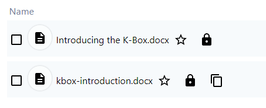
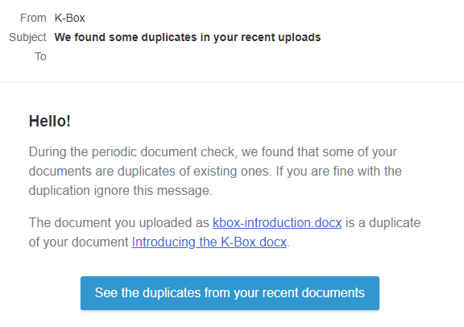

## Duplicate documents

The K-Box is capable of identifiyng exact file duplicates after their upload (See [#40](https://github.com/k-box/k-box/issues/40)).

When the upload completes, the duplicate is highlighted with the help of a badge. 

In addition after 30 minutes of the first duplicate is found, a notification will be sent to the uploader, i.e. the user that performed the file upload, with the list of identified duplicates.

**The rule**

A document `D1` (uploaded by user `U`) is considered a duplicate, of `D2`, if:

- The hash of the document `D1` is identical to `D2` hash and
- User `U` has direct access to `D2`, e.g. is in a collection shared with me, in a project I'm member.

In all other cases the upload is allowed. As an example you can re-upload a previous version of an existing document or two users can upload the same file in their personal space.

### What to do when duplicate is reported?

####  Resolve

_Note: This is only possible by the uploader of the duplicate_

Click on file to get to its details panel. Select "Duplicates" and "Resolve duplicate using this, already existing, document".

In case a duplicate is resolved by using the existing document, eventual collections applied to the duplicate are applied also to the existing document.

The owner of the existing document will not change. According to your permission levels the owner will be able to deny you the access to the document at any given time

#### Ignore
 You can also disregard the duplication notice.