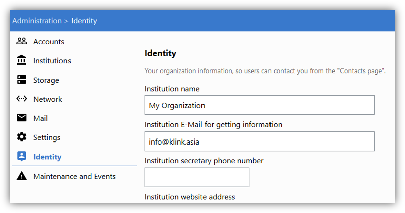

# Contacts page

_Only users with permissions of K-Box administrator can perform operations described below. Please contact your K-Box Administrator via email, indicating your interest in any of the points._

K-Box administrators can configure all institutional details of the K-Box owner. To do so, 

**Step 1:** go to “Administration” page 

**Step 2:** select “Identity” and fill in the fields. 

When you are finished, click “Save settings” at the bottom of the page.