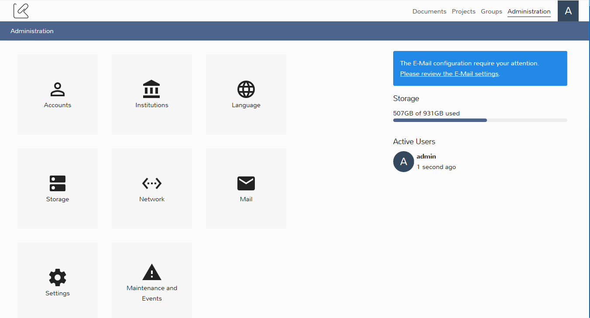

# Mail

The Mail administration section enable to configure how the K-Box sends emails. The K-Box rely on 
emails for user notification, password sending and password resets.

In order to send emails from the K-Box an email SMTP server is needed. The server **must support TLS Encryption**. 
If you don't have a SMTP server with that option, but you own an internet domain you can use free service like 
[Mailgun](https://www.mailgun.com/).

The configuration can be specified via User Interface or deployment configuration.

If you are the K-Box administrator and you are loggin-in for the first time a message, like the one in the next picture, 
is shown.

The message inform you that some (or all) the email configuration parameters are not specified. This parameter might 
include the server host and the address from which emails are sent.

Is important to specify those parameters to make sure users will receive account credentials and messages.

## Configuration via User Interface

The mail configuration is available via the _Administration > Mail_ page. On the first login the page might look like the 
picture below.

The emails are sent via an external provider. The provider should expose a SMTP (Simple Mail Transport Protocol) server.

The required configuration to make the K-Box able to send emails include:

- From Address: the email address from which the emails are sent, an example can be info@klink.asia. This address is very 
  important because it must exists otherwise emails might not be delivered to recipients at all.
- From Name: the name that most email clients shows instead of/in addition to the email address
- SMTP server host: the address of the email server
- SMTP server port: the port on which the email server is listening, usually 587 or 465, but sometime the email provider can 
  choose a different communication port
- SMTP credentials: the username and password for the authentication to the Email sending server

After entering all the parameters and saving the configuration, you can press the "Send a test E-Mail" button to send an 
email to the configured from address. This enables you to check if all parameters are correct. If the email cannot be send an 
error will be shown on the page. You can always get more information on the error from the _Maintanance and events page_.

## Configuration via deployment environment file

The K-Box also supports the ability to configure the email parameters at [deploy time](https://dev.klink.asia/klink-node/production-deployment), 
i.e. when the K-Box is installed.

The accepted configuration parameters are

- `MAIL_DRIVER`: The email driver to be used. Possible values are `log` and `smtp`. Default to `smtp`;
- `MAIL_HOST`: The email server host;
- `MAIL_PORT`: The email server communication port, default `587`;
- `MAIL_USERNAME`: The email server username;
- `MAIL_PASSWORD`: The email server password;
- `MAIL_FROM_ADDRESS`: The address used for sending emails, e.g. info@klink.asia
- `MAIL_FROM_NAME`: The name to show to recipients of the email

The `MAIL_HOST`, `MAIL_PORT`, `MAIL_FROM_ADDRESS` and `MAIL_FROM_NAME` are required.

Those settings can be overrided from the user interface, except for the `MAIL_DRIVER`.

If the `log` `MAIL_DRIVER` is set, the K-Box will be locked in a particular develpment mode that will write all the 
email messages to the log file, accessible from the _Maintanance and events page_. With this driver no real email will be sent.
Also, when the `log` driver is used, the administrator will not be able to change the server parameters from the UI.
