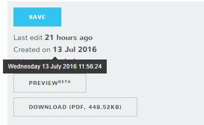
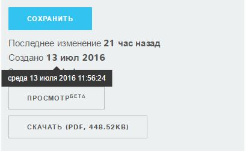

# DMS Project Edition 0.10.0 and 0.10.1

release date: `20 july 2016`

codename: [Karl Stromberg](http://villains.wikia.com/wiki/Karl_Stromberg) from the James Bond novel _The Spy Who Loved Me_

## New Project Edit page

The old UI made complicated the action to select new members and remove existing one from the project. Now that page is completly overhauled with a multiple select textbox with autocomplete for selecting users and a new members list.

## Big Changes to the recent page behavior

The recent page now shows the last 1000 updated documents in a timeframe of 3 weeks. All this parameters are configurable.

## Dates are now properly translated

A huge time ago users asked for proper dates translation in the various languages, now are finally here. 

## Permanent delete

For your personal documents now every user can permanently delete if the DMS Administrator enables the the permission on your profile. Project Managers can permanently delete a document by default.

The empty trash button will clean your trash entirely, no matter of the selection. If you want to permanently delete a document use the right click menu. And by the way this is also valid for collections.

## Move collection from personal to project updates

Moving a collection from your personal to a project takes into account also the sub-collections of the collection you are moving

## Preliminary Power Point preview

We are building a new foundation for the documents preview and everything starts with Power Point. In this super-early preview you will be able only to see the text in each slide, but we are working to make it pretty.

## Other features and bug fixes

- Administrators now properly see the project collections of a document in the details panel
- Network Name can be changed
- Rename of "Make public" button to "publish"
