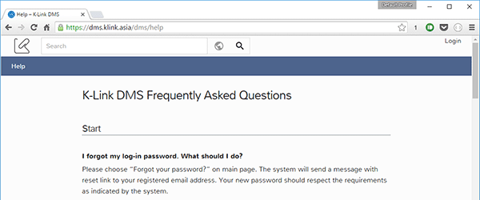
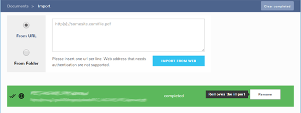

# DMS Project Edition 0.8.0

release date: 18 may 2016

codename: [Dr. Kananga](https://en.wikipedia.org/wiki/Live_and_Let_Die_(film))

This release marks a new internal way of handling the process and focuses on enhancements in areas that remained untouched for a long time. 
Also we are progressing in the full Russian translation and with this release we made a huge jump from 50% to 95%. Thanks to Albina for helping us in this big jump.

## Help Section

The Help section has always be a mystery, now we are starting to actually showing something more appropriate.

The Help page now lists the Frequently Asked Questions about Search, Collections and getting started. The whole page 
is translated into russian. You will see the English or the russian version according to the language setting of your profile (if logged in the DMS), otherwise you will 
see the page in the preferred language specified from your browser.

We know that the search on the top of the page is not linked to the FAQs listed, but the work here is not finished yet :)

## Progress in Russian translation

The Russian translation has always be limited to a set of small phrases here and there, but now we made huge progress on giving it the correct visibility.

Among the portion of the UI fully localized you will find:

- Context menu
- Question dialogs and error messages

## Retry and Remove single imports

Now the URL imports can be retried if an error occurred and can also be removed from the import list. You can also remove completed imports one by one.

## Collection tree navigation

Collections tree tend to be not so easy to navigate especially if you have a huge set of collections.

In this release we have made two small features:

1. The current opened collection is put in the visible space, so you can see the selected collection when you enter it
2. When a collection is opened the list of childs will be automatically expanded

Also the expansion of the parent collections (of the currently opened one) has been improved a little.

Please tell us what you think in the [Ideas and suggestions section](https://klink.uservoice.com/forums/303582-k-link-dms)

## Other features and bug fixes

- We put the same hint for the _Starred_ and the _Recent_ section, now the correct one is showed
- We fixed the document language not correctly showed on K-Link Public searches in the tiles and details view
- Faster thumbnail process and some new iconography for emails and zip archive
