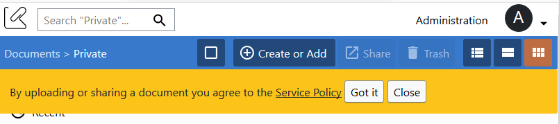

# DMS Project Edition 0.9.0 and 0.9.1

release date: `15 june 2016`

codename: [Francisco Scaramanga](https://en.wikipedia.org/wiki/Francisco_Scaramanga) from the James Bond novel _The Man with the Golden Gun_

## Collections showed on the Document Edit page can be used for navigation

You asked about the ability to use the collections listed in the document edit page to start a navigation and we added it.

## Newly created collection is highlighted and showed

You may have found yourselves wondering about the location of a newly created sub collection. Now is highlighted and pushed to be visible so you can discover it quickly.

## Error page are not so scary anymore

Finally we have a back button and the support widget on the error page

## Service Policy

We heard about the ability to show a Service Policy with information about copyrighted materials upload and code of conduct.

## Icons for Public and Private documents

Iconography is important to show information about documents without the need to open the details panel or the edit page.

In this version we have added icons for distinguish public and private documents on all the document list layouts.

## Other features and bug fixes

- Fixed a situation that could cause to list twice the same document in the search result
- Fixed a case that could trigger a document unpublish from K-Link Network
- Fixed links in the help section
- Fixed a case when second or third level collections are not keep visible after navigation
- Other minor fixes in the translations
- Updated English and Russian version of the Frequently Asked Questions
