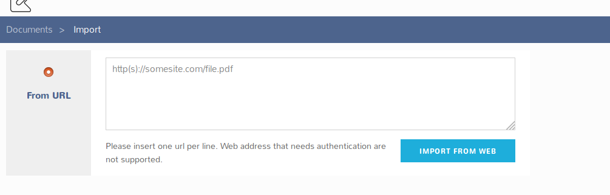

# Importing from URL

If a document is available on internet, the K-DMS can fetch it directly, using its URL.

On the document tab, you simply need to click on the "Create or Add" menu, then on "Import".

On the import page, paste the URL in the text field, and click on "Import from web". If you want to add a bunch of documents at once, just paste their URL in the text field, one per line.

The document will appear in your private documents.
