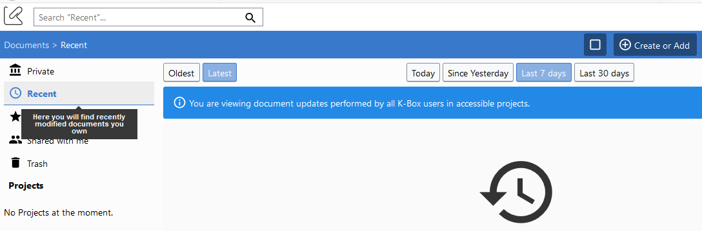
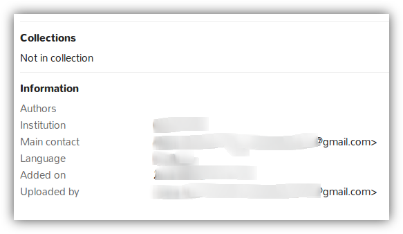

# Introduction

In K-DMS, DMS stands for Document Management System. It is a system meant to 
structure documents in an organization.

Thanks to features such as collections or *project*, it helps organizing and 
sharing presentations, images and other types of documents produced by 
collaborators inside and outside a structure.

# Documents
When you are on the `Documents` tab, you can access a few menu on the left part
of the screen. These menus help to quickly access documents important to you.

## Recent
  

By clicking on this link, the list part on the right will display all the docs
you recently modified or added.

## Starred
  

By clicking on this link, the list part on the right will display all the docs
you starred. Starring is a good way to maintain an easy access on the docs you
care about.

## Meta-data
When a document is uploaded information about it is gathered. It is called
meta-data. The information available is usually:
* The collections to which the document is associated
* Its author or authors 
* Its main contact
* Its language
* The date it was added
* The user who uploaded it

By clicking on a doc, it is possible to consult this information:

# Help
A help section containing a list of the most frequently asked questions is 
available when clicking on the *Help* menu, located at the bottom right corner.

  

# Projects

