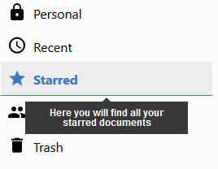
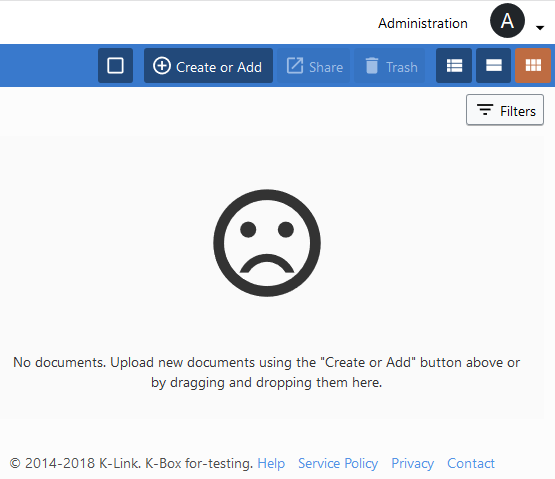

# Introduction

K-Box. It is a system meant to structure documents in an organization.

Thanks to features such as _collections_ or *project*, it helps organizing and sharing presentations, 
images and other types of documents produced by collaborators inside and outside an organization.

# Documents
When you are on the `Documents` page, you can access the left-hand navigation menu. 
These menus help to quickly access documents important to you.

## Recent
  

By clicking on this link, the list part on the right will display all the documents recently modified or added by you and your colleagues 
in accessible project and private collections. 

## Starred
  

By clicking on this link, the list part on the right will display all the files
you starred. Starring is a good way to maintain an easy access on the files you
care about.

## Navigate in collections

In order to go from a collection to another, you simply need to click on the
relevant name in the left panel. If the collection contains sub-collections,
the first level will appear automatically.

To collapse the list of sub-collections, simply click on the chevron arrow
located at the left of the project or collection name. If the chevron points toward the right, the collection is collapsed. If it points towards the bottom,
the collection is expanded.

# [Help](./help.md)
A help section containing a list of the most frequently asked questions is
available when clicking on the *Help* menu, located at the bottom right corner.

  

# [Projects](./projects/index.md)
