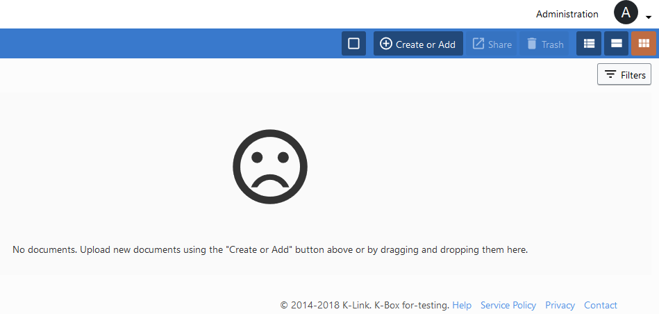

# Help

## Help widget

### Display
K-Box offers the possibility to display a [uservoice](https://www.uservoice.com/)
widget on every page for users to communicate to a help desk while browsing.

  

### Configuration
It requires to fill the _Support Token_ field in the _Administration_ > _Settings section_

  

## Help section

Documentation is available at any time. If you have a doubt about a feature, you
can access the Help section by simply clicking on the *Help* link at the bottom
right corner of the page.

