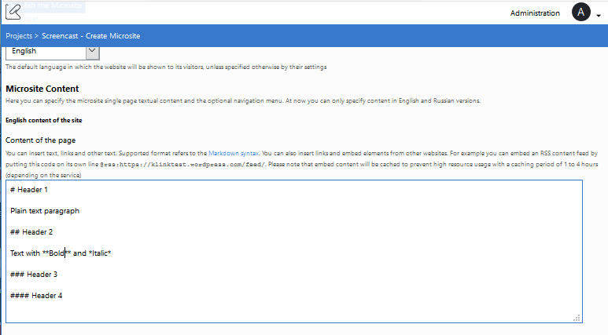
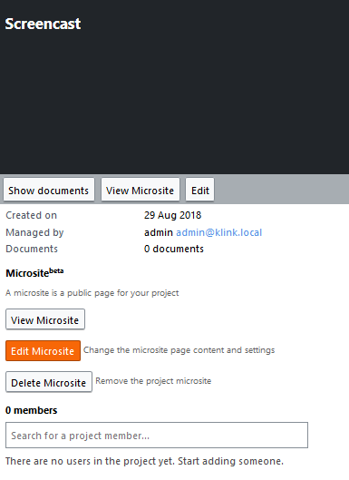

# Microsites
_Only users with permissions of project manager and higher can perform operations described below. Please contact your Project Administrator via email, indicating your interest in any of the points._

With the usage of Microsite(beta) you can create a single page website for your project. On that page you can put text, images and links.

Microsites are attached to Projects. You can only create a Microsite for an existing Project. A microsite can be seen as a public page that does not require login to be viewed.

## Viewing a Microsite

Microsites are reachable through a URL hosted on the K-Link K-Box. The URL is in the form

```
https://{dms-domain}/projects/{project-slug}
```

where `{dms-domain}` is the domain from which you access the K-Box (e.g. `dms.klink.asia/`), while `{project-slug}` is the project friendly name, 
usually is the project name with eventual spaces substituted with dashes. For example if a project name is _Project A_ the default slug is `project-a`. 
The slug is configurable, for more info please check the [Creating a Microsite section](#creating-a-microsite).

The URL of the microsite must be given to the users by the Project Administrator because there is no page that lists all 
the Microsite available on the K-Box (both for logged-in and guest users).

The current Microsite page layout is similar to the one showed in the figure below.


On the top navigation bar you can find

-  logo, which is a picture with maximum height of 80 pixels
-  search bar
-  language switcher
-  login and go to project link.

These links are mutually exclusive. The login button is showed only if user is not logged-in to K-Box. 


### Search from the Microsite

The Microsite offers a search box that lets your user search the accessible Public Network.


As pictured above, search will be perfomed on the Public Network - in this case, on the K-Link Network - if user is not logged in.

Learn more about search [here](.../documents/search.md)

### Multiple Languages

The Microsite can be viewed in two languages:

- English
- Russian

The content for both languages must be written by the Microsite creator.

The creator of the microsite can specify the default language to be showed to the users. The language switcher will enable the user to see the preferred version of the site. If the web browser is configured to send language preferences (English or Russian), 
the microsite will choose the language accordingly.

## Creating a Microsite

Microsites can be created by Project Administrators through the Project details panel.

On the Project details panel, you can press the button _Create Microsite_ (picture below) to start creating one.


From the Microsite creation page you can configure its every aspect.


### Microsite configuration parameters

There are several configuration parameters needed to create a Microsite

**Site name** (required)

The title of the Microsite that will be showed to the users. The default value is the Project name.

**Site human friendly slug** (required)

The friendly site name to be used in the URL of the microsite. The default value is a lower case version without spaces of the Project name.

A slug cannot have spaces or start with the `create` word.

**The website logo**

This will be the logo of the microsite and will be showed on the header. The image must be hosted on an HTTPS enabled website without authentication. 
Currently is not possible to host the image on the K-Box itself.

The image can be of any image type supported by browsers (git, jpg, png), but must not exceed the size of 350x80 pixels.

**Site description**

The description of the Microsite. This will not be showed to the users, but will be used only as a metadescription for search engines

**Site default language** (required)

Altought the microsite can be localized in Russian and English a default language must be specified. The default language will show the content to the users that have no 
preferences of the language set on the browser.

The list of default languages contains more languages than the available content translations, use only English or Russian otherwise your site will not be showed correctly.


### Microsite content

The Microsite content support the [Markdown syntax](https://daringfireball.net/projects/markdown/basics). Please refer to the official Mardown syntax for the content authoring.



### Notes

- currently microsites are updated 20 mins after your changes, if you need a faster refresh please contact the support

## Editing a Microsite

The edit of the Microsite can be performed only by the Project Administrator from the Project management page (figure below)



Pressing the _Edit Microsite_ button will redirect you to the Microsite edit page. The page is the same that is showed during the Microsite creation. 
For further details please refer to the [Creating a Microsite section](#creating-a-microsite).

## Deleting a Microsite

You can delete a Microsite at any point in time. Its removal will permanently delete all content (in any languages) and remove the public access to the page.

**This operation cannot be undone.**

The deletion of a microsite can be performed only by the Project Administrator, by pressing the _Delete Microsite_ button. A confirmation dialog, like the one pictured below, will be showed.

 

Once you hit _Remove_ the Microsite will be permanently deleted and the URL will not be reachable anymore.

## Previous: [Overview](../administration/intro.md)            

## Next: [Contacts](../administration/contacts.md)