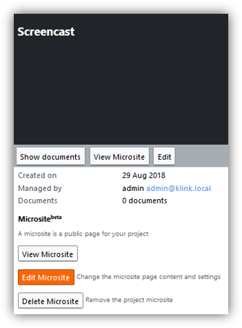
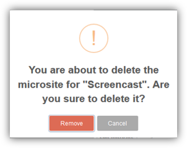

# Microsites
_Only users with permissions of project manager and higher can perform operations described below. Please contact your Project Administrator via email, indicating your interest in any of the points._

With the usage of Microsite(beta) you can create a single page website for your project. On that page you can put text, images and links.

Microsites are attached to Projects. You can only create a Microsite for an existing Project. A microsite can be seen as a public page that does not require login to be viewed.

## Viewing a Microsite

Microsites are reachable through a URL hosted on the K-Link K-Box. The URL is in the form

```
https://{dms-domain}/projects/{project-slug}
```

where `{dms-domain}` is the domain from which you access the K-Box (e.g. `dms.klink.asia/`), while `{project-slug}` is the project friendly name, 
usually is the project name with eventual spaces substituted with dashes. For example if a project name is _Project A_ the default slug is `project-a`. 
The slug is configurable, for more info please check the [Creating a Microsite section](#creating-a-microsite).

The URL of the microsite must be given to the users by the Project Administrator because there is no page that lists all 
the Microsite available on the K-Box (both for logged-in and guest users).


### Search from the Microsite

The Microsite offers a search box that lets your user search the accessible Public Network.


Learn more about search [here](.../documents/search.md)

## Creating a Microsite

Microsites can be created by Project Administrators through the Project details panel.

On the Project details panel, you can press the button _Create Microsite_ (picture below) to start creating one.


From the Microsite creation page you can configure its every aspect.

### Microsite content

The Microsite content support the [Markdown syntax](https://daringfireball.net/projects/markdown/basics). Please refer to the official Mardown syntax for the content authoring.


### Notes

- currently microsites are updated 20 mins after your changes, if you need a faster refresh please contact the support

## Editing a Microsite

The edit of the Microsite can be performed only by the Project Administrator from the Project management page (figure below)



Pressing the _Edit Microsite_ button will redirect you to the Microsite edit page. The page is the same that is showed during the Microsite creation. 
For further details please refer to the [Creating a Microsite section](#creating-a-microsite).

## Deleting a Microsite

You can delete a Microsite at any point in time. Its removal will permanently delete all content (in any languages) and remove the public access to the page.

**This operation cannot be undone.**

The deletion of a microsite can be performed only by the Project Administrator, by pressing the _Delete Microsite_ button. A confirmation dialog, like the one pictured below, will be showed.

 

## Previous: [Overview](../administration/intro.md)            

## Next: [Contacts](../administration/contacts.md)