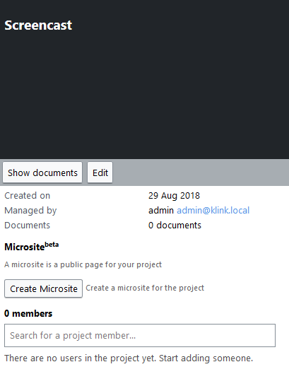

# Microsites

With the usage of Microsite(beta) you can create a single page website for your project. On that page you can put text, images and links.

Microsites are attached to Projects. You can only create a Microsite for an existing Project. A microsite can be seen as a public page that do not require login to be viewed.


Microsites are in currently beta phase so each release of the K-Box can introduce breaking changes.


## Viewing a Microsite

Microsites are reachable through a URL hosted on the K-Link K-Box. The URL is in the form

```
https://{dms-domain}/projects/{project-slug}
```

where `{dms-domain}` is the domain from which you access the K-Box (e.g. `dms.klink.asia/dms`), while `{project-slug}` is the project friendly name, 
usually is the project name with eventual spaces substituted with dashes. For example if a project name is _Project A_ the default slug is `project-a`. 
The slug is configurable, for more info please check the [Creating a Microsite section](#creating-a-microsite).

The URL of the microsite must be given to the users by the Project Administrator because there is no page that lists all 
the Microsite available on the K-Box (both for logged-in and guest users).

The current Microsite page layout is similar to the one showed in the figure below.


On the top navigation bar you can find

- the logo, which is a picture whose height cannot be more than 80 pixels
- the search bar
- the language switcher
- login and go to project link, these links are mutually exclusive, the login button is showed only if the user is not logged-in in the K-Box. 


### Search from the Microsite

The Microsite offer a search box that let your user search the K-Link Public Network or the Project.


As pictured above the search will be perfomed on the K-Link Public Network if the user is not logged in the K-Box.


### Multiple Languages

The Microsite can be viewed in two languages:

- English
- Russian

The content localized in both languages must be written by the Microsite creator.

The language switcher will enable the user to see the preferred version of the site. If the web browser is configured to send language preferences 
the microsite will choose the language to show based on that preference (if the language is available).

Also the creator of the microsite can specify the default language to be showed to the users.


## Creating a Microsite

The creation can only be performed by the Project Administrator through the Project management page that is under the Projects section (from the main navigation of the K-Box).

On the Project management page, of the project you want to have a microsite, you can press the button _Create Microsite_ (picture below) to start creating the Microsite.



The page showed in the next picture will be showed. From that page you can configure every aspect of the Microsite.


### Microsite configuration parameters

There are several configuration parameters needed to create a Microsite

**Site name** (required)

The title of the Microsite that will be showed to the users. The default value is the Project name.

**Site human friendly slug** (required)

The friendly site name to be used in the URL of the microsite. The default value is a lower case version without spaces of the Project name.

A slug cannot have spaces or start with the `create` word.

**The website logo**

This will be the logo of the microsite and will be showed on the header. The image must be hosted on an HTTPS enabled website without authentication. 
Currently is not possible to host the image on the K-Box itself.

The image can be of any image type supported by browsers (git, jpg, png), but must not exceed the size of 350x80 pixels.

**Site description**

The description of the Microsite. This will not be showed to the users, but will be used only as a metadescription for search engines

**Site default language** (required)

Altought the microsite can be localized in Russian and English a default language must be specified. The default language will show the content to the users that have no 
preferences of the language set on the browser.

The list of default languages contains more languages than the available content translations, use only English or Russian otherwise your site will not be showed correctly.


### Microsite content

The Microsite content support the [Markdown syntax](https://daringfireball.net/projects/markdown/basics). Please refer to the official Mardown syntax for the content authoring.


### Notes

- currently microsites are updated 1 hour after your changes, if you need a faster refresh please contact the support

## Editing a Microsite

The edit of the Microsite can be performed only by the Project Administrator from the Project management page (figure below)


Pressing the _Edit Microsite_ button will redirect you to the Microsite edit page. The page is the same that is showed during the Microsite creation. 
For further details please refer to the [Creating a Microsite section](#creating-a-microsite).

## Deleting a Microsite

You can delete a Microsite at any point in time. The removal of the microsite will permanently delete all the content (in any languages) and remove the public access to page.

**This operation cannot be undone.**

The deletion of a microsite can be performed only by the Project Administrator through the the Project management page.

Once you are in the project page that contain the microsite you want to delete press the _Delete Microsite_ button. A confirmation dialog, like the one pictured below, will be showed.

 

Once you hit _Yes Delete it!_ the Microsite will be permanently deleted and the URL will not be reachable anymore.

