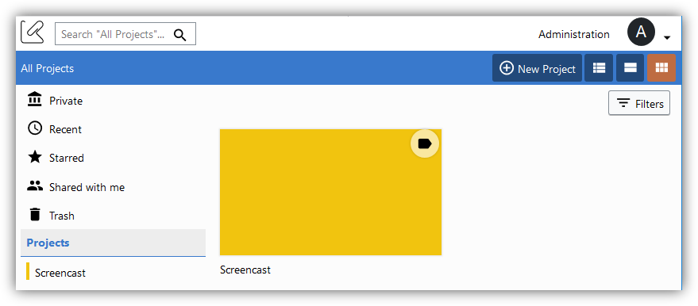

#### Previous: [Users management](../administration/users.md)

# Projects

Projects helps you create communities of user that shares a common goal. Projects can contain documents and collections and are accessible only by authorized users.

A project is created and maintained by a Project Manager and K-Box Administrator.

## Projects section

The management of the projects is performed from the _Projects_ page. If your profile has the Project Management capabilities, you will see the _New Project_ button

The page lists the created, managed and accessible projects. 

## Create a new Project

To create a new project press the button _New Project_ that is on the top right of the page

After inserting the project name, description and users press the _Create Project_.

## Project details

This page shows members of the project and the personalization options, like the Microsite (Check the [Microsite section](../microsite/index.md) for more info).

This page is showed when you select _Details_ from the right-click menu of a project.

## Edit an existing project

To edit a project press the _Edit_ button that is listed in the right-click menu. 

Save your changes, when finished. 

## Deleting a project

Currently a project cannot be deleted.

## Microsites

A project can have a single website. Check the [Microsite section](../microsite/index.md) for more info.

## Work with documents

For more information about the K-Box, check the [Documents](https://git.klink.asia/main/k-box/blob/Update-Help-Project-section/docs/user/en/getting-started.md) or [Work with documents](https://git.klink.asia/main/k-box/blob/Update-Help-Project-section/docs/user/documents/work-with-documents.md) pages

#### Next: [Identity](../administration/identity.md)

