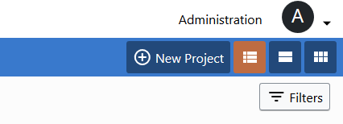

# Projects

Projects helps you create communities of user that shares a common goal. Projects can contain documents and collections and are accessible only by authorized users.

A project is created and maintained by a Project Manager (sometimes also called Project Administrator).

## Projects section

The management of the projects is performed from the _Projects_ page. If your profile has the Project Management capabilities, you will see the _New Project_ button

The page lists the created, managed and accessible projects. 

## Create a new Project

To create a new project press the button _New Project_ that is on the top right of the page

You are redirected to the project creation page (figure below).

The project must have a name. 

The project description can contain free text that describes the project, with or without an avatar.

The _Add users to the project_ field can have more than one user at once and offers username autocomplete.

If you click inside the field a dropdown list will popup. The list will only contains the users that can be added, in other words all the users that are not already in the project and don't have a Guest profile. 

The user list field has search capabilities, if you start writing the name of a user the dropdown list gets filtered. Keep in mind that the search is performed by checking if the written characters are contained in the username in the same order you wrote.

After inserting the project name, press the _Create Project_ button that is at the very bottom of the page.

## Project details

This page shows at a glance the members of the project and the personalization options, like the Microsite (Check the [Microsite section](../microsite/index.md) for more info).

This page is showed when you select _Details_ from the right-click menu of a project.

In this page the members of the project are listed in alphabetical order with the respective Institution affiliation.

## Edit an existing project

To edit a project press the _Edit_ button that is listed in the right-click menu. 

After clicking on the _Edit_ button the page will change to the project editing mode, like the picture below. 

The picture below shows the Project Details and Add user section of the editing page of a Project.

The Project Details hosts the name and the description of the project.

The add users to the project section can be used to add new members to the project. It has the autocomplete and multivalue supports, as expressed in the create project section.

At the bottom of the edit page you can see the _Current members list_ that shows the users already added to the project and enable the removal of those users.

## Deleting a project

Currently a project cannot be deleted.

## [Microsites](../microsite/index.md)

A project can have a single website. Check the [Microsite section](../microsite/index.md) for more info.

## [Work with documents](.../documents/work-with-documents.md)

## Previous: [Overview](../intro.md) 
## Next: [Identity](../administration/identity.md)

