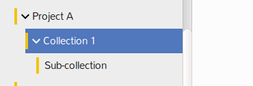

## Organization of files

The files are being organized in accessible projects and [other sections](./getting-started.md#files-navigation). Users can organize files in My Collections according to their preference. Private collections are colored green for distinction from project collections (orange). Please do right-click on the collection where you intend to create an internal structuring, select "New Collection". Hit the arrow-like symbol on the collection to see the subcollections.

K-Box collections behave differently from folders in the following way:
- You can assign your document to more than one collection  
- Changes to the file will be visible in all assigned collections

Click on your file to get an overview of all assigned collections. To add a file to a collection, simply drag and drop it onto one. 

Hit the “X” symbol to remove collection.