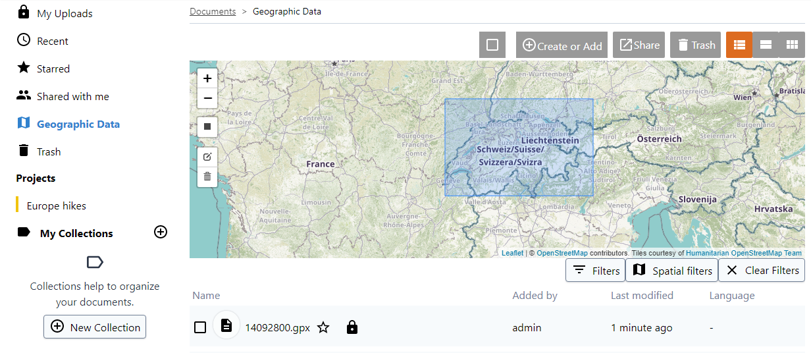

### Geographic Data

The Geographic Data section list all uploaded files in projects/collection you have access that are geographic files. For geographic files we mean files that contains maps, GPS trace or, generally, polygons and surfaces that are placed on the Earth. Examples of those files can be Google Earth (KML) files, ESRI Shapefiles, GeoTiff, GPS Tracker recordings (GPX format).

This section is only available if the administration enabled the [Geographic Plugin](../../plugins/geo/readme.md). 

Using Spatial filters, you can retrieve all available geographical files in a specific area. For that, draw (and also edit/delete) a rectangle by clicking on the respective icon on the left side of the map.