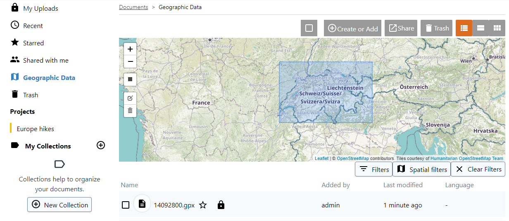

### Geographic Data

Geographic Data section contains geographic files, like GeoTiff, ESRI Shapefiles, GPS tracker recordings (GPX format) and Google Earth files. The feature can be enabled by admin. 

More information about [Geographic Data](https://git.klink.asia/main/k-box/blob/update-help-page/plugins/geo/readme.md).