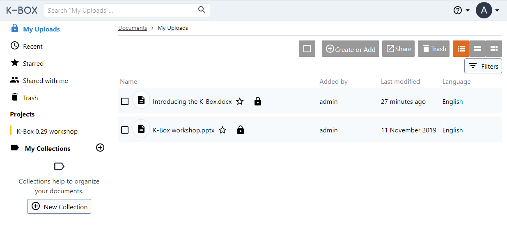
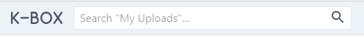
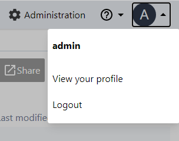
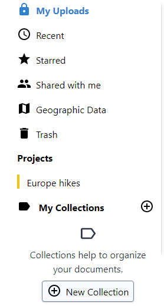

# User documentation

K-Box is a web-based Free and Open Source Data Management Tool. It offers a flexible approach for managing documents and for disseminating them.

By default, the K-Box interface opens in [My Uploads](./personal.md) section on Documents page. 

In the upper menu you can select all files, create new collection or upload a new file, share and trash selected files and also choose view option.

 

#### [Search](./search.md)

In the upper left corner you can search among your files.

#### Personal preferences

Personal settings in the upper right corner under the first letter of your name.

#### Files navigation

You can access the left-hand navigation menu where files are categorized into [My Uploads](./personal.md), [Recent](./recent.md), [Starred](./starred.md), [Shared with me](./shared-with-me.md), [Geographic Data](./geodata.md) and [Trash](./trash.md). Besides that you can find accessible projects and/or organize files in [collections](./collections.md).

