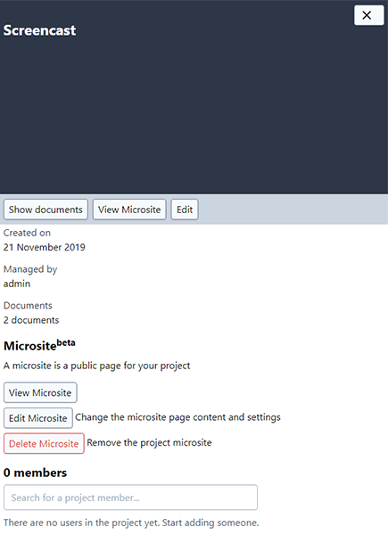

# Microsites

_Only users with permissions of project manager and higher can perform operations described below. Please contact your Project Administrator via email, indicating your interest in any of the points._

With the usage of Microsite(beta) you can create a single page website for your project. On that page you can put text, images and links.

Microsites are attached to Projects. You can only create a Microsite for an existing Project. A microsite can be seen as a public page that does not require login to be viewed.

> Microsite support is behind [feature-flag](../developer/flags.md)

## Viewing a Microsite

Microsites are reachable through a URL hosted on the K-Link K-Box. The URL is in the form

```
https://{dms-domain}/projects/{project-slug}
```

where `{dms-domain}` is the domain from which you access the K-Box, while `{project-slug}` is the project friendly name, 
usually is the project name with eventual spaces substituted with dashes. 
For example if a project name is _Project A_ the default slug is `project-a`. 

### Search from the Microsite

The Microsite offers a search box that lets your user search the accessible Public Network.


Learn more about search [here](./search.md)

## Creating a Microsite

Microsites can be created by Project Administrators using the button _Create Microsite_ on the Project details panel.


### Microsite content

The Microsite content support the [Markdown syntax](https://daringfireball.net/projects/markdown/basics). 


### Notes

- currently microsites are updated 20 mins after your changes, if you need a faster refresh please contact the support

## Editing a Microsite

The edit of the Microsite can be performed only by the Project Administrator from the Project management page, pressing the _Edit Microsite_ button



## Deleting a Microsite

You can delete a Microsite at any point in time. Deletion of a microsite can be performed only by the Project Administrator, by pressing the _Delete Microsite_ button.

> **This operation cannot be undone.**
