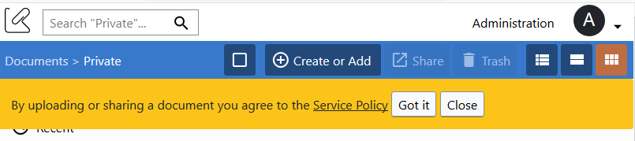
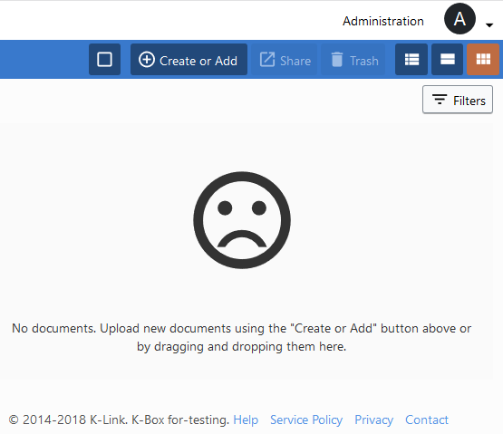

# Service policy

Like most of services that manages data we are showing you a message to highlight the introduction of the _Service Policy_.  

The picture above shows how the message appears on the screen after the login.

We don't want to bother you about the _Service policy_, but we want you to take 5 minutes to read it because it might contain 
useful information about copyrighted material.

When the _Service Policy_ message appears you will have two options

1. Agree to the policy by clicking "Got it"
2. Close the message

If you close the message the message will not be showed again on the browser (e.g. Firefox) you used at the time of pressing the button.

Closing the message will not prevent you to upload files or sharing documents, but in future this Policy might be enforced.

You could read the complete policy at any time, by clicking the _Service Policy_ link on the footer.

