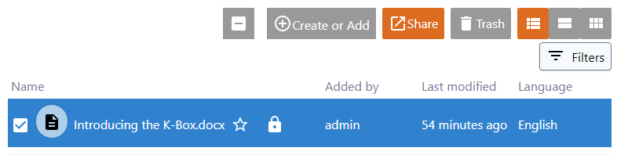
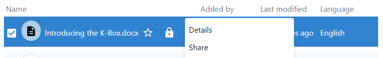
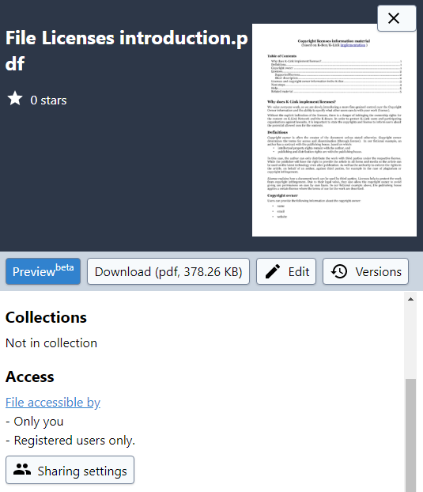

# Sharing

K-Box sharing options are available through the Sharing window, that can be accessed through:

_Share_ button on the top navigation bar 

or _Share_ option in the right-hand menu

or _Sharing settings_ on details panel

If _Who has Access_ is set to **Only authenticated users can access** , the recipient should appear in the following list.

If _Who has Access_ is set to **Anyone with link can access**, go ahead and send the link. 
The recipient will not appear in the following list. 

The latter is true for Public documents, too.

## Sharing to a user

Sharing a file or collection is done via the sharing dialog. To create a new share open the sharing dialog.

On the sharing dialog there is a text field, under the _Who has access_ section, in which users can be added. 
To add a new user start typing at least 2 letters of the name and the system will suggest 6 users that 
matches your terms. To ensure a more precise completion type at least 4 letters.

In case you know the exact email address you can type it and the K-Box will find the user that matches it.

> For respecting the privacy the K-Box will not show the email address of the matched users.

**I don't see the user in the completion**

Users you already shared the same file with will not be included in the search.
