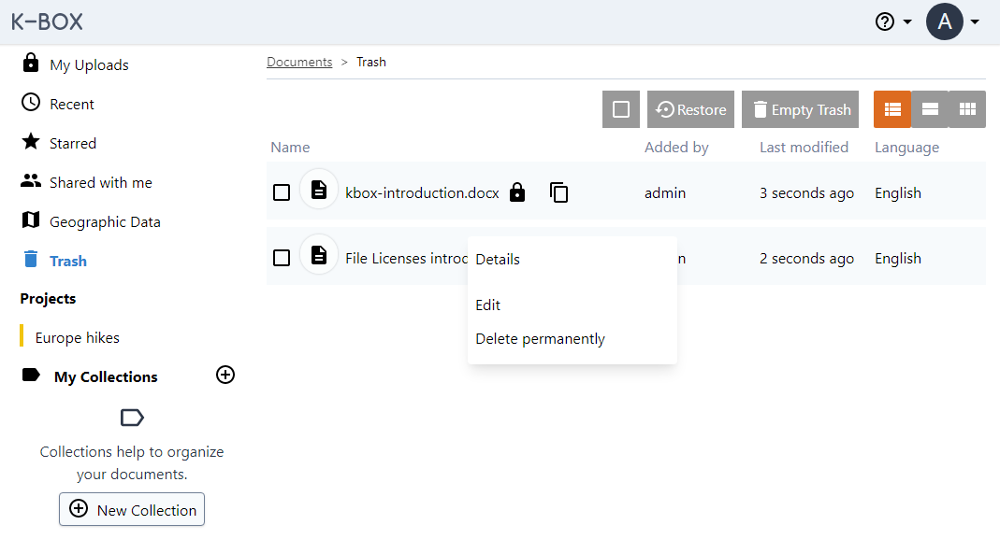

# Trash

The trash contains every document and collection you delete. It gives you a second chance to not loose your documents.

The picture above shows an example of the trash content.

When you trash a collection also the sub-collections are trashed.

> The administrator trash shows everything that has been trashed, so pay close attention

## Permanently delete a document or a collection

You can permanently delete a single document or a collection by using the mouse right click menu (also called context menu). There you can find the action _Permanently Delete_, like in the picture below.

The current release cannot permanently delete a selection of collections and documents at the same time.

Trashed collections can only be permanently deleted by its creator, or the project manager if they were in a project.

## Empty the trash

To permanently delete all the documents and collections in the trash you can use the _Empty Trash_ button. Pressing that button will permanently remove all the trash content.

