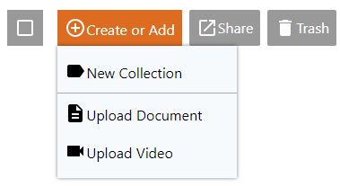

## Upload

To add a new file, select the collection or sub-collection in which the document will be stored.

There are several options for uploading a file into K-Box:

For _videos_ use the "Create or Add"  → “Upload Video" option

For _any other file_, use “Create or Add” → “Upload Document” or simply drag and drop 

#### Supported video formats

The K-Box offer special support for mp4 video files encoded with H.264 codec (with AAC or MP3 audio). The minimum supported resolution is 480x360 pixels. The maximum supported resolution is 1920x1080 pixels.

#### Duplicates

To learn how the K-Box users handle _duplicates_, please go [here](./duplicates.md#resolve)
