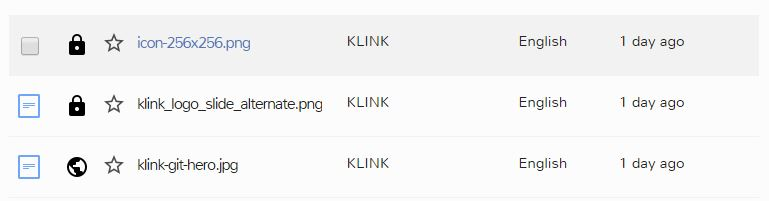
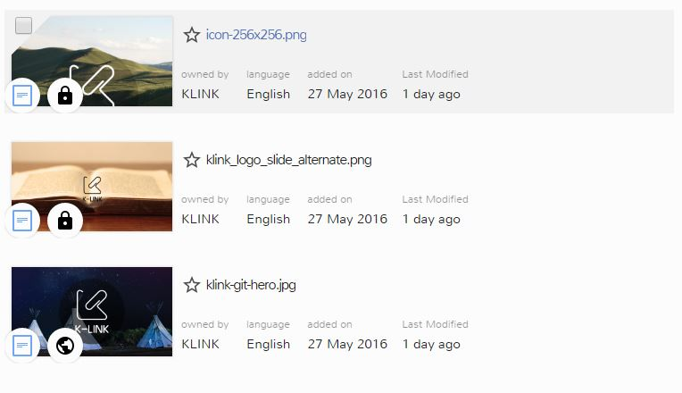
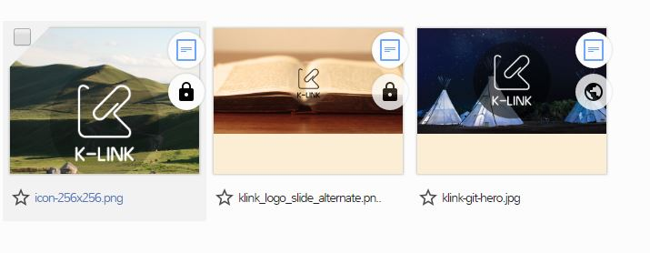

# Documents Viewing Options

The K-Box has three different ways of showing the documents list

1. Details
2. Tiles
3. Grid

The selector for changing the visualization is on the colored band on the top right of the screen (highlighted in the picture below)

## Details View

The details view is the most compact layout available and shows one document per line as it enables to see all the document details for almost every document in the page (12 documents are displayed on each page).

The information are represented in columns. From the left of the picture

- Document Icon and selection box. The selection box appears only while hovering the document with the mouse, when another document is selected and stays visible if the document is selected
- Public or Private icon
- Star. Shows if a document is starred and enable to star/unstar a document
- Document title
- Institution of the user who uploaded the document for the first time
- Language
- Date of last edit

## Tiles View

The tiles layout uses one line per document, but with an expanded style

In this view is also available the thumbnail of the document, which is an image that describes the content of the document. For multipage documents is always taken from the first page.

The icons and information showed are the same of the details view, but with different positioning and labels. In addition the date of the upload in the K-Box is showed.

## Grid

The grid view put emphasis on the document thumbnails. The number of elements per line varies from one to six (depending on the browser window size)

## Icons

Different symbols are used for each document.

**Star**

1. The document has not been starred
2. The document has been starred and is a private document
3. The document has been starred and is a public document

**Public** or **Private**

1. The document is private
2. The document is visible in the K-Link public network
