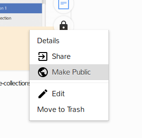
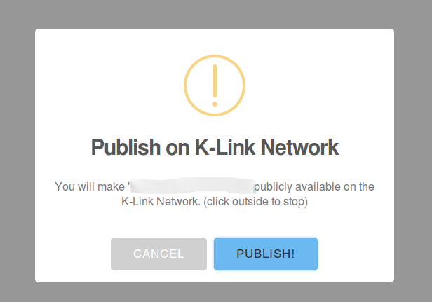

# Make public
You can decide that a document should be visible throughout the K-Link network. For this, just follow these steps:

1. Identify the document you want to make public
2. Right click on it   

3. Click on "Make public" to confirm

