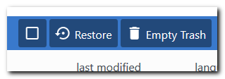

## Delete file

If you want to delete file, do a right click on the selected file and click on "Move to Trash" option. This action also available from [upper action menu](./getting-started.md).

You can also restore or fully remove files from [Trash](./getting-started.md#files-navigation) section.

