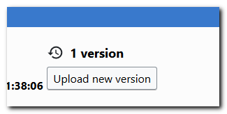

## Edit meta-data

By clicking on a document, you access its [meta-information](./meta-data.md).

Select "Edit" to change title, author, language, version, [resolve duplicates](./duplicates.md#resolve) or assign [license](./licenses.md#license) to your file.

## Edit file
If you want to edit a document, you can download it, edit it offline and upload it again, by using the button _Upload a new version_ on the metadata page. 

Note that if you upload an already existing document (by drag-and-dropping or by using the Upload a new version), your file will be identified as a [_duplicate_](./duplicates.md).