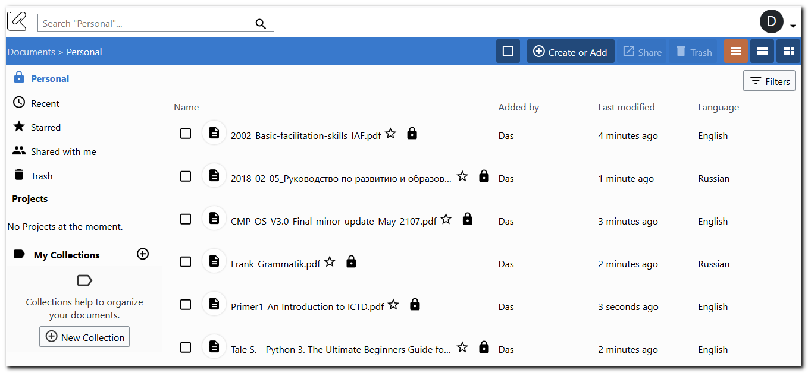
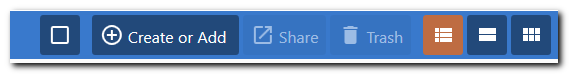
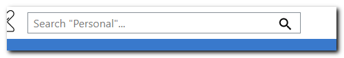
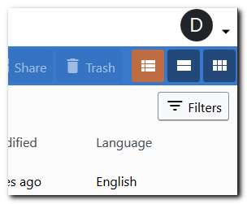
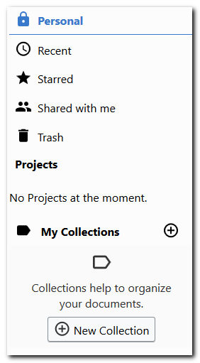

# Getting started

K-Box is a web-based Free and Open Source Data Management Tool. It offers a very flexible approach for managing documents and for disseminating them.

By default, the K-Box interface opens in your Personal section on Documents page. 

In the upper menu you can select all files, create new collection or upload a new file, share and trash selected files and also choose view option.

 

In the upper left corner you can search among your files.

Personal settings in the upper right corner under the first letter of your name.

You can access the left-hand navigation menu where files are categorized into Personal, Recent, Starred, Shared with me, Trash. Besides that you can find accessible projects and your personal files organized in the collections

