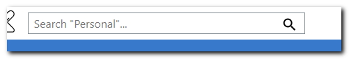

# Search

In the upper left corner you can search among accessible files.

You can search anywhere in the K-Box, except Trash. The scope depends on location search is triggered in. Hence, if a sub-collection is currently selected, your search will run only within this sub-collection. From the Projects page, your search goes through all available projects.

Use filters for more accurate search.

Use comprehensive keywords, following naming convention and boolean operators for better search:

- `OR`: find documents which contain either one of the keywords. When no operator is entered, the `OR` operator is assumed by the system. E.g. `Markhor report 2014` keyword combination is understood by the system as: `Markhor OR report OR 2014`
- `AND`: matches documents where both terms are used anywhere in the text. E.g. `Markhor AND report AND 2014` will display documents where all the keywords are mentioned.
- `+`: a word after this operator must exist in documents retrieved after search is performed. E.g., `+Markhor AND report AND 2014` will search for all three key-words, but with a stronger focus on "Markhor". The result searches might also include documents containing only "Markhor", but not necessarily "report" and "2014".
- `NOT`: any document containing the keyword that you write after this operator will be excluded from the search results.
- `*`: when you do not remember the whole word (common with names/surnames), you can use this operator as a wild card. the symbol can be used to look for beginning or end of the word ( * in the end or beginning of the keyword respectively). E.g. `Mar*` will return documents containing words like `Markhor`, `March`, `Marina`, etc. 

You can of course combine all those operators in order to get more relevant search results. For more information about search operators, refer to the following [documentation](https://lucene.apache.org/core/2_9_4/queryparsersyntax.html)

### Search tip

Star your file clicking next to its title and it will appear in [Starred](./getting-started.md#files-navigation). This functionality is limited to files hosted on your K-Box.