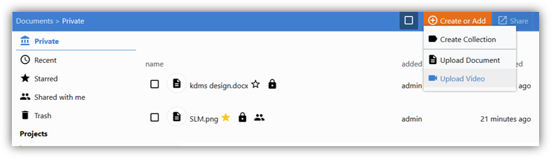
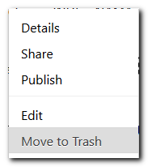
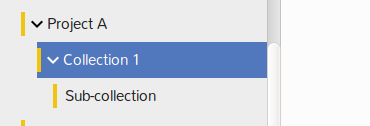

## Upload

To add a new document, select the collection or sub-collection in which the document will be stored.

There are several options for uploading a file into K-Box:

For _videos_ use the "Create or Add"  → “Upload Video" option

For _any other file_, use “Create or Add” → “Upload Document” or simply drag and drop 

#### Supported video formats

The K-Box offer special support for mp4 video files encoded with H.264 codec (with AAC or MP3 audio). The minimum supported resolution is 480x360 pixels. The maximum supported resolution is 1920x1080 pixels.
 
## Edit meta-data

By clicking on a document, you access its [meta-information](./meta-data.md).

Select "Edit" to change title, author, language, version, [resolve duplicates](./duplicates.md#resolve) or assign [license](./licenses.md#license) to your file.

## Edit file
If you want to edit a document, you can download it, edit it offline and upload it again, by using the button _Upload a new version_ on the metadata page. Note that if you upload an already existing document (by drag-and-dropping or by using the Upload a new version), your file will be identified as a [_duplicate_](./duplicates.md#resolve). 

## Delete file

If you want to delete file, do a right click on the selected file and click on "Move to Trash" option.

## Organization of files

You can organize your files in accessible projects, in "My Collections" and [other sections](./getting-started.md). Private collections are colored green for distinction from project collections (orange). Please do right-click on the collection where you intend to create an internal structuring, select "New Collection". Hit the arrow-like symbol on the collection to see the subcollections.

K-Box collections behave differently from folders in the following way:
- You can assign your document to more than one collection  
- Changes to the file will be visible in all assigned collections

Click on your file to get an overview of all assigned collections. To add a file to a collection, simply drag and drop it onto one. 

Hit the “X” symbol to remove collection.
